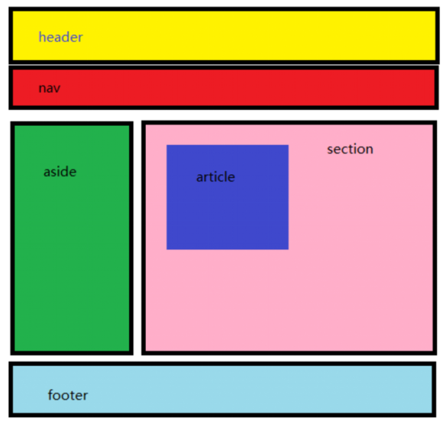

# 15-有语义的标签

## 1. 有语义的布局标签

|    标签名    |  语义   |
|:---------:|:-----:|
| `header`  | 网页头部  |
|   `nav`   | 网页导航  |
| `footer`  | 网页底部  |
|  `aside`  | 网页侧边栏 |
| `section` | 网页区块  |
| `article` | 网页文章  |

这些有语义的标签,就是用于替换`div`和`span`标签的,让我们的代码更加有语义化,更加清晰明了.