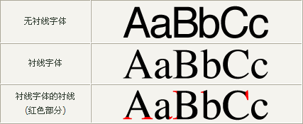

# 15-字体族

## 1. 属性名

- `font-family`

## 2. 属性值

- `font-family: 字体族名称;`

font-family属性值可以书写多个字体名,各个字体名用**逗号**隔开,执行顺序是**从左向右**依次查找

Windows的默认字体为微软雅黑;Mac的默认字体为苹方

`font-family`属性**最后**设置一个**通用字体族名称**,用于在前面字体都不支持的情况下使用

例子中的`sans-serif`就是通用字体族名称.这种字体族会根据不同的操作系统自动选择合适的字体.这个字体族并不是一个具体的字体,而是一个字体族的名称

```css
p {
    font-family: "微软雅黑", "宋体", "Arial", sans-serif;
}
```

字体族名称的中文可以使用Unicode编码表示,例如`宋体`就可以写成`\5B8B\4F53`

网页开发建议使用**无衬线字体**.因为字号一旦变小,容易看不清楚.

