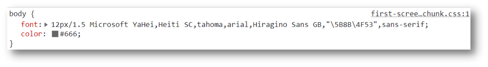

# 16-字体复合属性

## 1. 复合属性的顺序

1. `font-style`(是否倾斜)
2. `font-weight`(是否加粗)
3. `font-size/line-height`(字号/行高)
4. `font-family`(字体)

**CSS,复合属性的属性值之间都是以空格分隔**

只有2个属性必须写:

1. 字号(可以不写行高)
2. 字体

其他属性可以省略

## 2. 使用场景

使用场景: **设置网页文字公共样式**

通常把这个复合属性设置在`body`标签上

