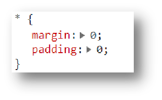
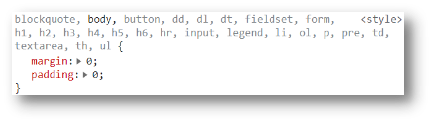

# 12-清除默认样式

清除标签默认的样式

比如:

- 默认的内外边距.因为有些标签有默认的内外边距,这样会影响我们的布局
- `li`标签的小圆点,也会影响布局 
- `body`标签,有默认的8px的margin

## 1. 清除默认样式




第2种写法效率更高,因为第1种写法会给所有标签都加上样式,而第2种写法只给需要清除的标签加上样式

```css
blockquote, body, button, dd, dl, dt, fieldset, form, h1, h2, h3, h4, h5, h6, hr, input, legend, li, ol, p, pre, td, textarea, th, ul {
    margin: 0;
    padding: 0;
}
```

CSS3中,除了设置内外边距外,还会把块元素设置为内减模式

```css
* {
  padding: 0;
  margin: 0;
  box-sizing: border-box;
}
```

## 2. 清除`li`标签的默认样式

```css
li {
  /* 清除li的小圆点 */
  list-style: none;
}
```

**这两段相当于是CSS的初始化,所有的页面上来都得先写这两句**