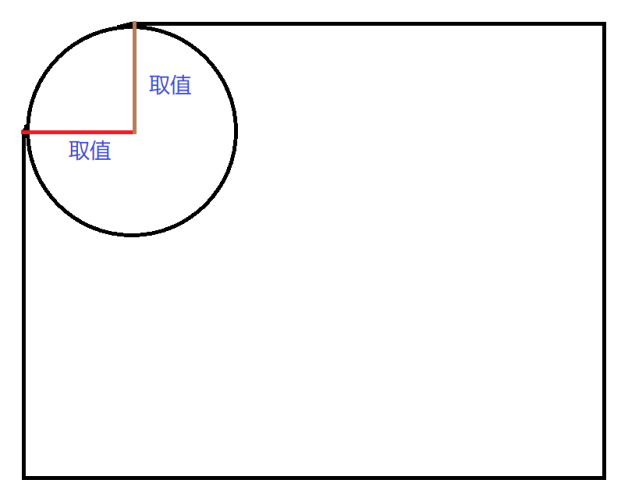

# 16-圆角边框

## 1. 作用与属性

- 作用: 设置元素的外边框为圆角
- 属性名: `border-radius`
- 属性值: `数字+px`/`百分比`
  - 数字越大,角越圆;数字是宽高的一半,则盒子就变成圆形了
    - 这个数字是一个半径,半径越大则圆越大,圆越大则弧度越小,视觉效果上看起来角就越圆了
  - 百分比:
    - 半径在水平方向上占盒子宽度的百分比
    - 半径在垂直方向上占盒子高度的百分比
    - 也就是说如果盒子的宽高不相等,则这个圆是椭圆.等价于用椭圆去切盒子的角
- 提示: 属性值是圆角半径

## 2. 常用的圆角形状

- 针对正方形盒子,将半径设置为宽度的一半或50%,则盒子变成正圆形
- 针对长方形盒子,将半径设置为高度的一半,则盒子变成胶囊型