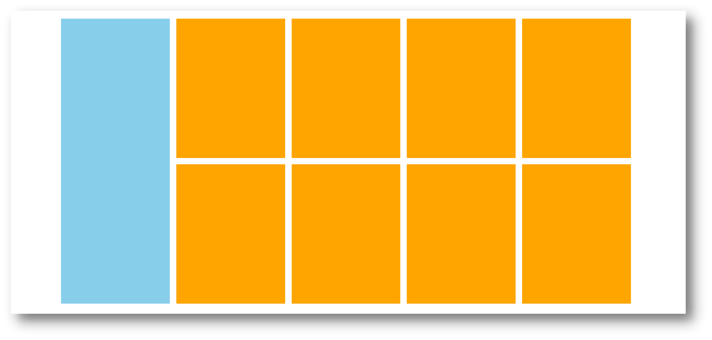

# 05-小米模块布局

## 1. 关于浮动的补充

- 浮动后的盒子**顶对齐**,是指顶对齐是指盒子的顶部与父盒子的顶部对齐
- 也就是说,我们可以通过定位父盒子的方式,来控制浮动盒子的位置
- 通常父盒子都是版心盒子

## 2. 布局练习

### 2.1 我的思路

- 外部父盒子
- 左侧蓝色是一个单独的盒子(盒子A),8个小盒子的位置是另一个盒子(盒子B)
- 盒子A和盒子B要浮动(因为要横向排列)
- 盒子B分为上下2部分,每部分是1个横条盒子
- 每个横条盒子里有4个浮动的小盒子

### 2.2 他的思路

- 外部父盒子
  - 小米的版心宽度是1226px
- 内部左侧是一个左浮动的盒子(蓝色);内部右侧是一个右浮动的盒子(8个橙色的小盒子的父盒子)
- 8个橙色小盒子用li实现,每个li都是浮动的
  - 问题: 8个盒子设置浮动会换行,而换行时上下是帖在一起的,他是如何解决的?
  - 解决: **就算浮动的盒子受父元素影响被迫换行,给下外边距依然生效**

### 2.3 测量问题

- 外部大盒子: 1226 * 614;
- 蓝色盒子: 234 * 614;
- 8个li的父盒子: 978 * 614;
- li: 234 * 300;右外边距/下外边距: 14px;
  - 最右侧的那2个li是不要右外边距的
  - 下面一排是不需要下外边距的
  - 但实际上最好的做法是,给8个li的父盒子设置`overflow: hidden`,这样下面一排的下外间距样式可以不用动,同时还不影响布局
  - 最后发现不管这个下外边距也没问题,因为8个li的父盒子给了高度了,不会影响到它外边的元素