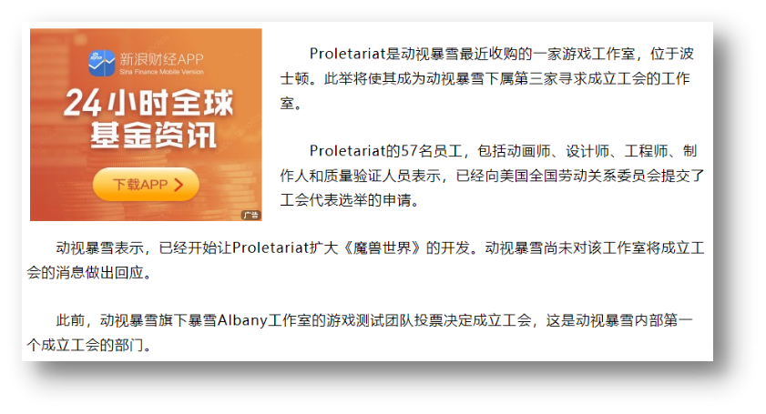

# 07-浮动总结

## 1. 属性名与属性值

- 属性名`float`
- 属性值:
  - `left`: 左浮动
  - `right`: 右浮动

## 2. 特点

1. 浮动后的盒子**顶对齐**
2. 浮动后的盒子具备**行内块**特点
3. 如果父级**宽度**不够,浮动的子级会**换行**(但是这个换行依然可以通过`margin`来控制垂直方向的距离)
4. 浮动后的盒子**脱标**

## 3. 清除浮动

### 3.1 问题

子级设置浮动,且父级没有高度时,由于子级无法撑开父级高度,会影响布局效果

### 3.2 解决方案

双伪元素法

## 4. 拓展

浮动本质作用是实现**图文混排**效果,而不是用作布局

