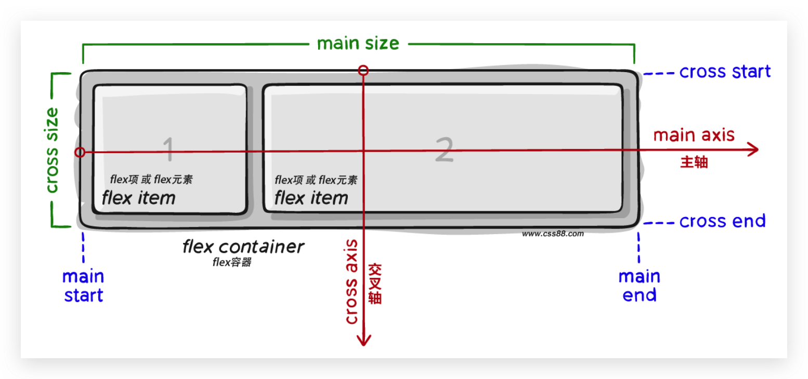

# 09-Flex的组成

- Flex布局必须有父元素,其核心思路就是通过父元素来控制子元素 
- 设置方式: 给**父**元素设置`display: flex`,子元素可以**自动挤压或拉伸**

## 1. 组成部分

- 弹性容器(父元素)
- 弹性盒子(子元素,又叫弹性条目)
- 主轴: 默认在**水平**方向
  - 即图中的`main axis` 
- 侧轴/交叉轴: 默认在**垂直**方向
  - 即图中的`cross axis` 

注意:主轴和侧轴的方向是可以发生改变的,所以在Flex布局中,对齐方式不再是水平/垂直,而是主轴/侧轴

## 2. Flex布局的属性

|      描述      |        属性         |
|:------------:|:-----------------:|
|   创建flex容器   |  `display: flex`  |
|    主轴对齐方式    | `justify-content` |
|    侧轴对齐方式    |   `align-items`   |
|    弹性盒子换行    |    `flex-wrap`    |
| 某个弹性盒子侧轴对齐方式 |   `align-self`    |
|    修改主轴方向    | `flex-direction`  |
|    弹性伸缩比     |      `flex`       |
|    行对齐方式     |  `align-content`  |