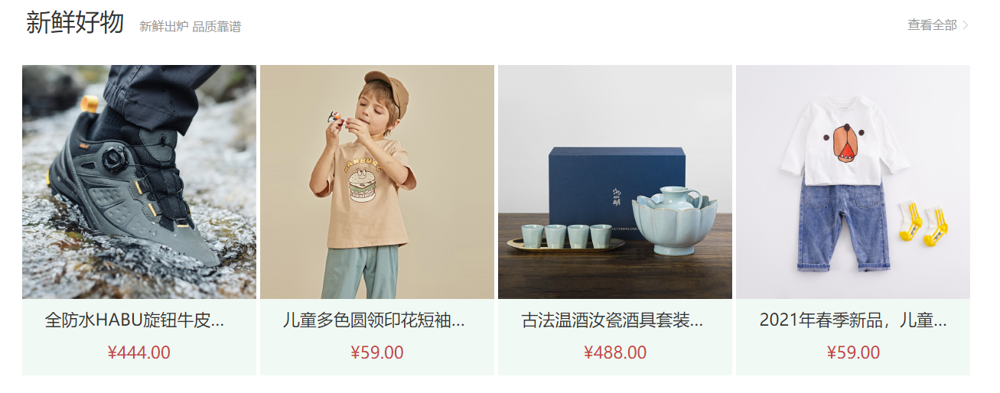

# 12-综合案例

## 1. 我的思路

### 1.1 大块区分

头部一块,列表一块

- 注意头部和列表都是有内边距的(上下左右都有),所以最外层的盒子要给边距
- 注意头部和列表之间也是有上下边距的

### 1.2 头部

- 头部分2个盒子,这两个盒子使用Flex布局,给头部设置`justify-content: space-between`.因为这2个盒子一个贴左一个贴右

#### 1.2.1 贴左的盒子

- 贴左的盒子里,放一个h2和一个p
  - 贴左的盒子也使用Flex布局,也是给贴左的盒子设置`justify-content: space-between`和`align-items: flex-end`
  - 因为我看到段落和标题是底部对齐的
  - 实现时的问题:`align-items: flex-end`只是让元素对齐了,文字并没有底端对齐
  - 这么放可能不对,但是我想不到更好的放法.因为从语义上来讲,标题不该和段落放在同一行里

#### 1.2.2 贴右的盒子

- 贴右的盒子里单独放一个p即可
  - 这个p和贴左盒子里的p是底部对齐的,所以贴右的盒子也要设置`align-items: flex-end`

### 1.3 列表

- 列表盒子里放1个ul,里边是4个li
  - 给贴右的盒子设置`justify-content: space-between`和`align-items: center`
  - 因为我看到4个li是水平排列且和父盒子左右贴住的

### 1.4 li

- li设置内容居中对齐
- 图片大小可能比li大,所以给一个宽,高等比缩放即可
- h4
- p
- 注意图片与h4之间,h4与p之间有上下间距

### 1.5 我自己感觉有问题的地方

1. 头部的文字底部对齐不会做,我只是靠行高往下压,看起来像是底部对齐了一样,但实际上仔细查绝对没对齐

## 2. 他的思路

### 2.1 大块区分

他也是上下2个盒子,这一步我做的是没错的

这里我整体的思路是对的,上下结构用标准流,有多个盒子需要横向排列时用Flex布局

### 2.2 头部

这里我的思路就有问题了:

- 因为已经是Flex布局了,不管元素本身是块元素还是行内元素,都已经不再有原来的布局特性了
- 所以也不需要再在h2和p外边套一层div了(也就是我代码中的`head-left`和`head-right`)

此外还有内容底部对齐的问题:

- 我当时使用的是h2和p(二者是兄弟关系),底部没有对齐
- 但是我看他的代码使用的是h2里边包span(二者是父子关系),这样再设置`align-items: flex-end`就可以实现底部对齐了
- 我需要确认的是:是我的标签结构问题,还是我使用的标签不对的问题

头部盒子的高度:**通过上下内边距来撑开的**

- 头部盒子不用给高,通过`上下内边距 + 字体大小`,把盒子的高度撑开即可
- 这里我在布局时,还犯了一个错误:
  - 布局应该从大到小,我是先把左侧的h2和p完全都实现了,再去弄的右边的p
  - 正确做法应该是先让左右盒子贴边(左边贴左,右边贴右),再去实现里边的内容
  - 这里他的设计是h2包span,其实他加这个span就是为了布局那些小字用的
  - 我当时的`align-items: flex-end`没生效,大概率是因为我多加了一层盒子(`head-left`和`head-right`)
- `align-items: flex-end`的底对齐是会受内间距影响的,不会直接到元素的最底部
- 最后修改span里的文字大小即可

### 2.3 列表

- 这里设置图片大小我的做法也有问题,是直接写100%(继承父元素宽度),而不是给一个写死的宽度!
- 这里设置上下间距也是,之前讲过,尽量在1个元素上设置,而不是在2个元素之间设置

## 3. 测量问题

- 最外层的盒子: 1240 * 541
  - Flex布局通常父元素是不给高的,让子元素撑开即可
- 头部盒子:
  - 它不是通过指定高度撑开的,而是通过`上下内边距 + 字体大小`撑开的
  - 上下内边距: 40px
  - 标题字号: 32px 不加粗
  - 小字字号: 16px #999999
- 主体盒子:
  - li大小: 306 * 406
  - 背景色: #f1f9f4
  - h4字号: 22px 不加粗
  - h4外边距: 上12px 左右没有 下20px
  - p字号: 18px orangered

## 4. 重做

1. 底对齐是没有问题的,按照我的做法(h2和p是兄弟关系),大字和小字之间是没有水平方向上的距离的
2. **他之所以用父子关系,是因为h2和span要贴左,而a要贴右(这是需求).如果按我的设计(h2和p是兄弟),那就必须给h2和p外边加一层div.这是我的设计上真正的缺陷**
3. 我的设计在视觉上是有问题的.就算在p上加了一个空格,p的位置比底对齐的要低,看起来没有底对齐
4. **结论: 以后这种两侧贴边,其中有一侧内容样式不同的,只是调样式即可,不是用div包.本质上用div包跟用h2包没区别**