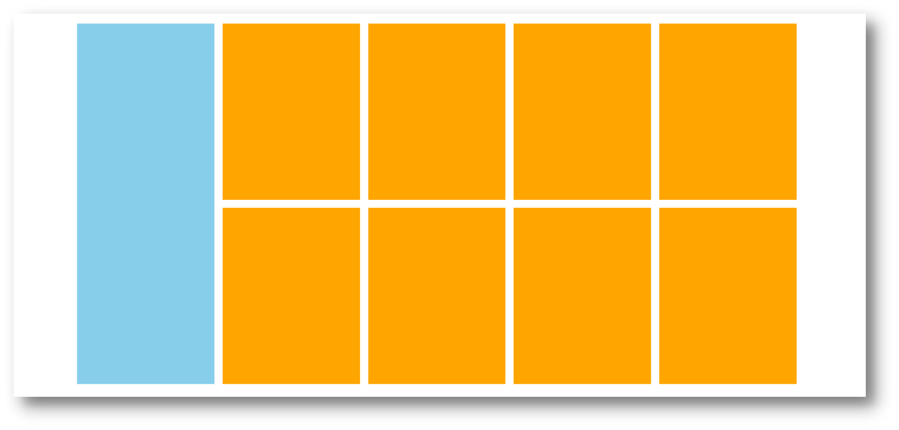

# 02-小米布局flex版本

## 1. 测距

- 大盒子: 1226 * 614
- 左侧竖着的盒子: 234 * 614
- 右侧放li的盒子: 978 * 614
- li: 234 * 300

## 2. 问题

1. 如果想要设置侧轴对齐方式,需要让ul有高度
   - 这是因为flex布局是布局在父元素上的,如果父元素没有高度,那么高度是由子元素撑开的
   - 此时无论设置子元素使用何种侧轴对齐方式都是无效的,因为父元素和子元素高度相同
2. 如果弹性条目是多行的,那么设置align-items是无效的
   - 此时暂时使用的方案是: 设置下外边距,同时取消最后一行的下外边距(其实不取消效果是一样的,因为li的外边距不会导致ul的高度增加) 