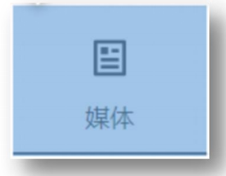

# 05-更改主轴方向

主轴默认在水平方向，侧轴默认在垂直方向

## 1. 属性名与属性值

- 属性名: `flex-direction`
- 属性值:

|       属性值        |       效果        |
|:----------------:|:---------------:|
|      `row`       |  水平方向,从左向右(默认)  |
|  `row-reverse`   |    水平方向,从右向左    |
|     `column`     | 垂直方向,从上到下(用的最多) |
| `column-reverse` |    垂直方向,从下到上    |

## 2. 使用场景

如图示:

1. 要求2个弹性条目垂直排列
2. 水平和垂直方向都居中

这种时候就要修改主轴方向了.说白了主轴方向决定的是弹性条目的**排列方向**

## 3. 注意

如果修改主轴方向为从上到下,此时侧轴的方向是从左到右,而非从右到左