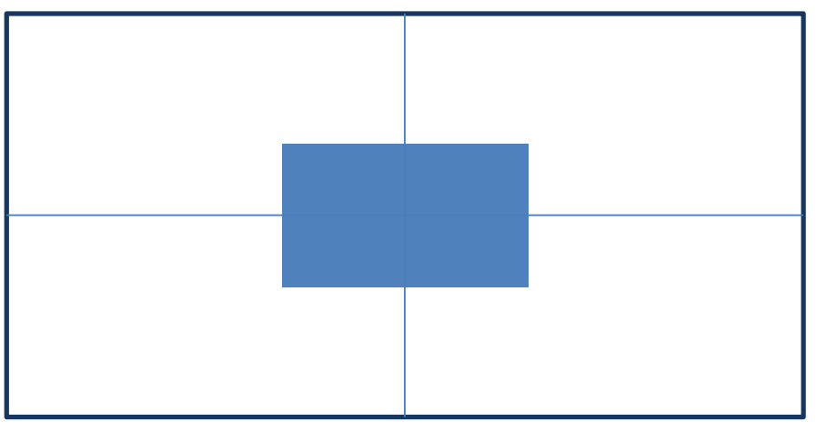

# 04-绝对定位盒子水平垂直居中

## 1. 实现步骤

1. 绝对定位
    - 因为这个弹窗盒子要压住所有的盒子,因此必然是绝对定位(脱标)
    - 这个效果不需要给父元素加相对定位,因为要求这个盒子是出现在浏览器的水平垂直居中位置,而不是相对于父元素的水平垂直居中
    - 注意,加了绝对定位的盒子,`margin: 0 auto;`中的`auto`会失效,但设置外边距仍然生效
2. 水平、垂直边偏移50%
    - 这里的水平边偏移50%,即:盒子左边框与父元素(本例中就是body)左边框的距离为父元素宽度的一半
    - 同理,垂直边偏移50%,即:盒子上边框与父元素上边框的距离为父元素高度的一半
3. 子级向左、上移动自身尺寸的一半
    - 做完上一步之后,盒子的位置是偏右、偏下的;换言之就是盒子的左上角那个点是在父元素的中心位置,因此盒子还需要往左、往上移动自身宽高的一半
