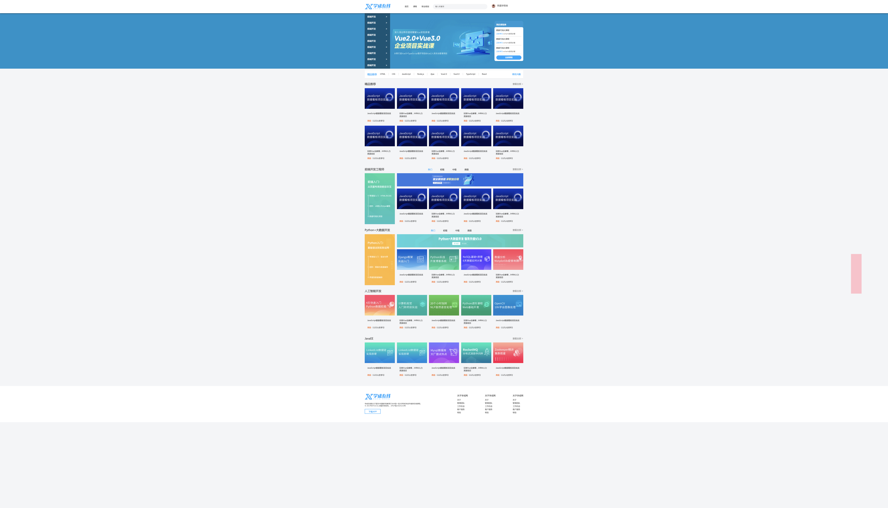

# 07-侧边栏的实现

我一开始的想法:

```css
/* side-bar开始 */
.side-bar {
    position: fixed;
    right: 200px;
    top: 50%;
    width: 80px;
    height: 300px;
    background: pink;
}
/* side-bar结束 */
```

这样写的问题,在缩放页面时就出现了:



解决思路:

1. 先使用`top: 50%`和`left: 50%`将侧边栏的左上角定位到页面的中心
2. 再基于这个位置进行移动,向右移动版心宽度的一半,就贴在版心的右侧了
3. 再向右多移动一点,拉开一点缝隙