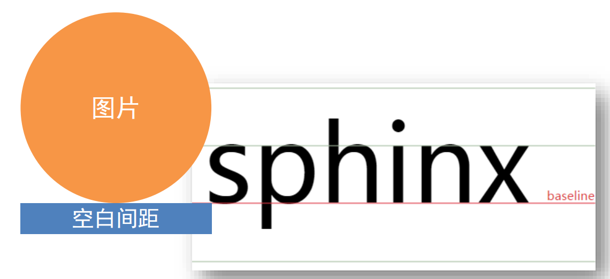

# 16-垂直居中

## 1. 属性名与属性值

- 属性名: `vertical-align`
- 属性值:

|    属性值     |    效果    |
|:----------:|:--------:|
| `baseline` | 基线对齐(默认) |
|   `top`    |   顶部对齐   |
|  `middle`  |   居中对齐   |
|  `bottom`  |   底部对齐   |

注意这个属性是用于行内元素的,对于块级元素是不起作用的.因为只有行内块元素需要考虑在一行内如何对齐的问题

## 2. 图片底部有空白缝隙的问题

如案例所示,即使给ul加了`align-items: center;`,图片距离ul的底部也还是有缝隙(5.5px的缝隙)

这是因为图片是行内元素,默认是基线对齐的,所以图片底部有空白缝隙(这个缝隙是留给文字的,比如像`y`这种字母,在基线下方是有内容的字母)

解决方法:

1. 给图片设置`vertical-align`属性,只要不是默认的`baseline`,任何对齐方式都可以
2. 把图片转换成块级元素(因为只有行内块元素需要考虑行内对齐的问题)

## 3. 给img设置`border:0`的原因

在IE6等低版本浏览器中,图片默认是有边框的,所以为了兼容性,给图片设置`border:0`