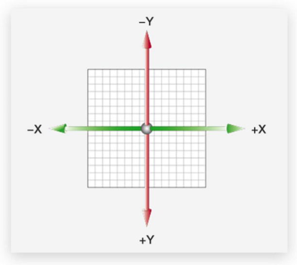

# 02-平面转换-位移

## 1. 作用

- 作用: 为元素添加动效,一般与过渡配合使用

## 2. 概念

- 概念: 改变盒子在平面内的形态(位移/旋转/缩放/倾斜) (**注意不止有位移 还可以缩放/倾斜**)
- 平面转换又叫2D转换,因为所有动效都是在一个平面内完成的
- 属性: `transform`
- 通常配合`transition`属性使用

## 3. 位移

- `translate(x,y)`: 沿着x/y轴位移
- 取值:
    - `px`: 像素
    - `%`: 百分比(相对于要位移的盒子自身的宽高)
- 单独设置x/y轴位移
    - `translateX(x)`
    - `translateY(y)`

## 4. 案例-子盒子垂直水平居中

需求: 在一个父盒子内,让子盒子上下左右垂直居中

### 4.1 思路1: 定位 + 位移

### 4.2 给子盒子设置上/左外边距

- `margin-top: (父盒子的高度 - 子盒子高度)/2`
- `margin-left: (父盒子的宽度 - 子盒子宽度)/2`

缺点: 一旦盒子(无论父子盒子)的大小发生变化,都需要重新计算外边距

## 5. 案例-双开门

## 5.1 思路

- 父盒子里有两个子盒子
- 父盒子有背景图
- 左右2个盒子有精灵图(其实也是背景图)
- hover时,让2个子盒子分别向左/右位移,露出父盒子的背景图

## 5.2 注意事项

注意子盒子移出时要隐藏,要使用`opacity`属性才能渐变,`overflow:hidden`不能渐变