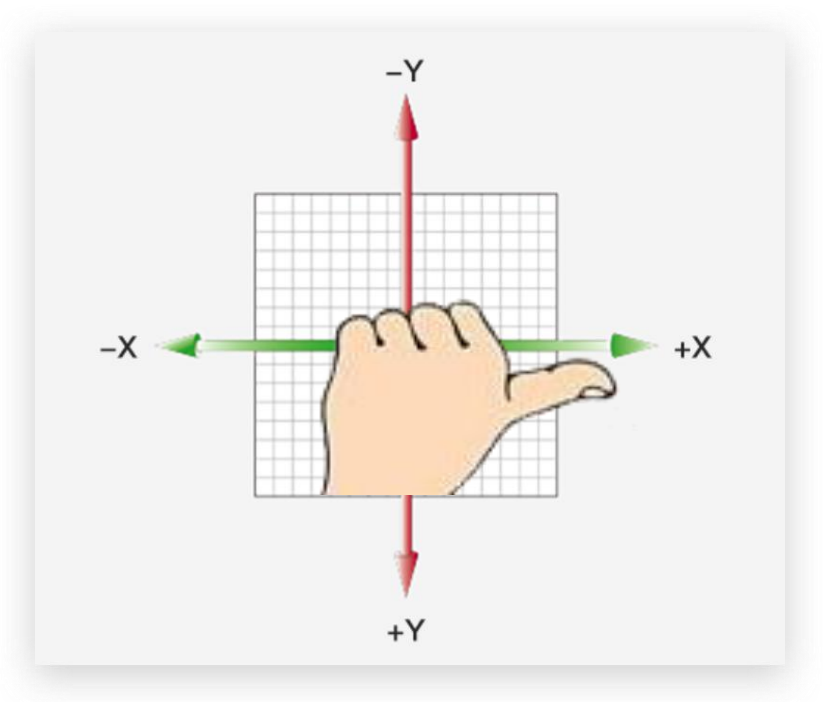

# 08-空间旋转

## 1. 基本使用

- 属性: `transform: rotateX/Y/Z(Ndeg)`
    - `rotateX`: 绕X轴旋转
        - 正值: 向前(向屏幕外)旋转
        - 负值: 向后(向屏幕内)旋转
    - `rotateY`: 绕Y轴旋转
        - 正值: 向右旋转
        - 负值: 向左旋转
    - `rotateZ`: 绕Z轴旋转
        - 正值: 顺时针旋转
        - 负值: 逆时针旋转
    - 方向判断方式: 左手握住旋转轴,拇指指向轴的正方向,此时手指弯曲方向即为旋转的正值方向

## 2. 自定义轴方向

- 属性: `transform: rotate3d(x,y,z, Ndeg)`
- 其中x,y,z取值通常在[0, 1]之间,表示一个向量在x/y/z轴上的分量
- `Ndeg`: 旋转的角度
- 在某个方向上旋转的角度: N * 该方向的分量