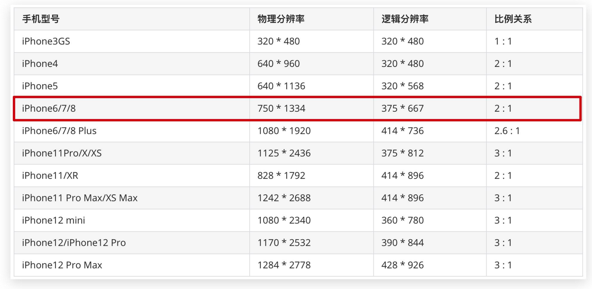

# 02-分辨率

## 1. 物理分辨率与逻辑分辨率

物理分辨率:是屏幕自身的属性,它是指屏幕上显示的像素点的数量.通常用水平像素数和垂直像素数来表示.例如:

- 1366x768
- 1920x1080
- 2560x1440

逻辑分辨率: 是指在屏幕上显示的像素点的数量.它是由物理分辨率和缩放比例共同决定的.例如:

- 1366x768,缩放比例为100%,那么逻辑分辨率就是1366x768
- 1366x768,缩放比例为150%,那么逻辑分辨率就是910x512(1366/1.5=910,768/1.5=512,这也就是为什么放大后的图片会变得模糊的原因)
  - 或者可以理解为,缩放后的1个像素点的大小,是原来的1.5倍
  - 那同样的宽度(高度)范围内,能显示的像素点就变少了
  - 像素点少了,自然就模糊了
- **写页面时,参考逻辑分辨率**

## 2. 移动设备的分辨率

- UI在给移动端设计稿时,都是以iPhone6/7/8为标准的,即375x667