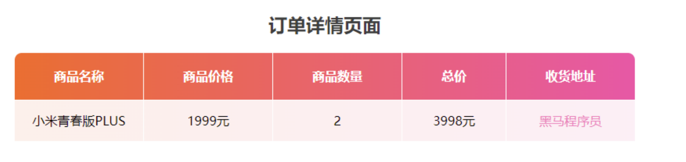

# 26-案例-用户订单

## 1. 需求

- 用户输入商品价格和商品数量,以及收货地址,页面显示商品订单信息表格

## 2. 实现思路

- step1. 先把表格的样式抄出来
  - 内部不要边框: `border-collapse: collapse;`
  - 给行加渐变色:
    - 选中行: `table tr:nth-child()`
    - 渐变色: `background: linear-gradient(to right, #f5f7fa, #c3cfe2);`
- step2. 用JS生成table的时候写入变量即可