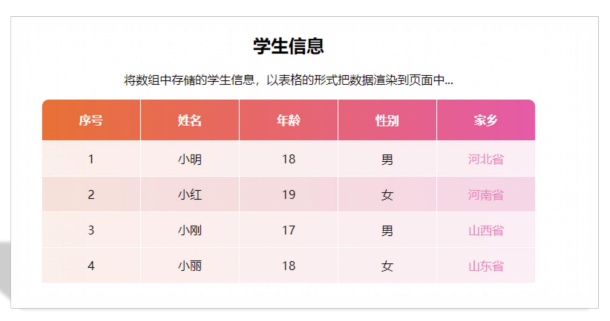

# 05-案例-渲染数据

```javascript
let students = [
    { name: '小明', age: 18, sex: '男', hometown: '河北省' },
    { name: '小红', age: 19, sex: '女', hometown: '河南省' },
    { name: '小刚', age: 17, sex: '男', hometown: '山西省' },
    { name: '小丽', age: 18, sex: '女', hometown: '山东省' }
]
```

要求渲染到页面上,渲染的效果如下图示:

