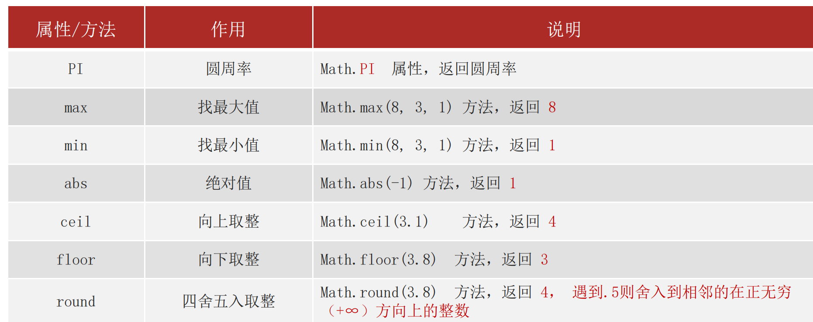

# 06-Math内置对象

## 1. 内置对象

- 内置对象: JS内部提供的对象,包含各种属性和方法给开发者调用
  - `console`
  - `document`

## 2. Math对象

- [Math对象API](https://developer.mozilla.org/zh-CN/docs/Web/JavaScript/Reference/Global_Objects/Math)

