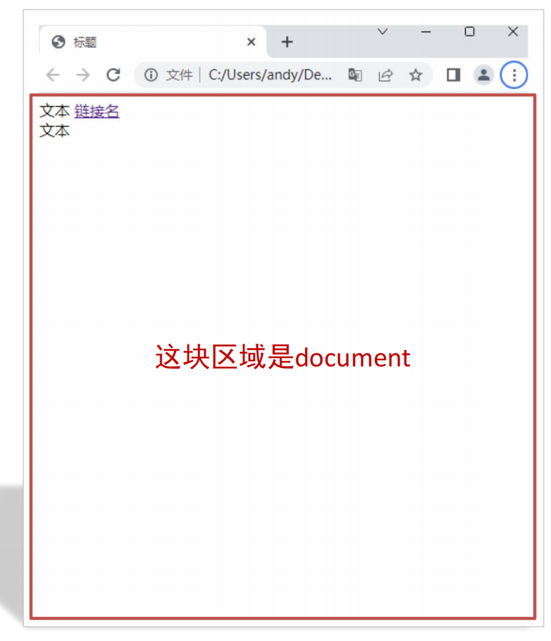

# 01-什么是DOM

## 1. DOM

- DOM: Document Object Model,文档对象模型
- 作用: 通过DOM来操作网页文档,开发交互效果
- DOM的核心思想: **把网页内容当做对象处理**,通过对象的属性和方法来操作网页内容

## 2. document对象

- 是DOM的根节点(顶级对象)
- 作用: 代表整个文档,可以通过document对象来操作整个文档
- 可以认为它提供的属性和方法都是用来**操作和访问网页内容**的
- 从代码的角度上来讲,从`<html>`开始,到`</html>`结束的所有内容都是document对象的内容

