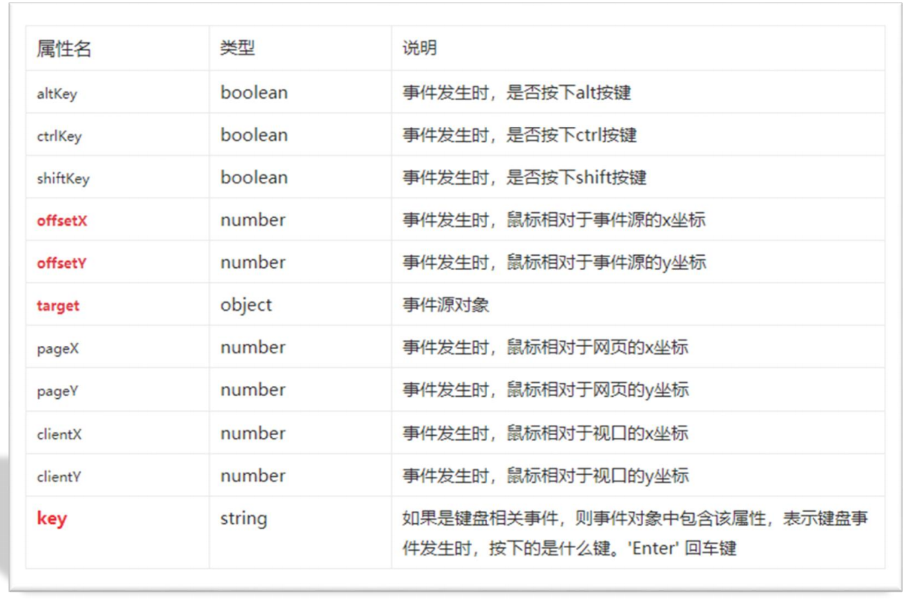

# 11-事件对象

- 事件对象: 也是一个对象,该对象中保存了事件触发时的相关信息
- 例如: 鼠标点击事件中,事件对象中保存了鼠标点击的坐标信息
- 使用场景:
  - 可以用于判断用户按下了哪个按键
  - 可以判断用户点击了哪个元素
- 语法: 事件处理函数中的第一个参数就是事件对象,通常命名为`event`/`ev`/`e`
- 不同事件的事件对象也是不同的

```javascript
document.onclick = function (event) {
  console.log(event)
}
```



- 注意: 
  - `input`事件和`keydown`/`keyup`事件中的事件对象是不同的
  - `event.target`属性可以获取到事件源对象(也是一个DOM对象)