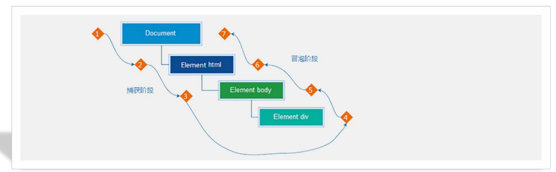

# 01-事件流

## 1. 问题

```html
<!DOCTYPE html>
<html lang="en">
<head>
    <meta charset="UTF-8">
    <title>01-事件流</title>
    <style>
        * {
            margin: 0;
            padding: 0;
            box-sizing: border-box;
        }
        
        .father {
            width: 300px;
            height: 300px;
            margin: 100px auto;
            background: skyblue;
            text-align: center;
        }
        
        .son {
            width: 150px;
            height: 150px;
            background: pink;
            margin: 60px auto;
        }
    </style>
</head>
<body>
<div class="father">
    父盒子
    <div class="son">子盒子</div>
</div>

<script>
    const father = document.querySelector('.father')
    father.addEventListener('click', function () {
        alert('父盒子')
    })
    
    const son = document.querySelector('.son')
    son.addEventListener('click', function () {
        alert('子盒子')
    })
</script>
</body>
</html>
```

此时,点击子盒子,会弹出两个弹框,为什么?

## 2. 事件流

- 事件流: 事件执行过程中的**流动路径**
- 当触发事件时,会经历2个阶段:
  - 捕获阶段: 事件从最外层元素,一层一层向内传递,直到目标元素
    - 事件捕获: 当一个元素的事件被触发时,会从DOM根元素开始,依次调用**同名事件(从外向内)**,直到目标元素
  - 冒泡阶段: 事件从目标元素,一层一层向外传递,直到最外层元素
    - 事件冒泡: 当一个元素的事件被触发时,会从目标元素开始,依次调用**同名事件(从内向外)**,直到DOM根元素



## 3. 事件捕获

- `DOM.addEventListener(事件类型, 事件处理函数, 是否捕获)`
- 默认为`false`,即冒泡阶段执行事件处理函数
- 设置为`true`,即捕获阶段执行事件处理函数

## 4. 事件冒泡

- 简单理解: 当一个元素触发事件**后**,依次向上调用所有父级元素的**同名事件**,直到DOM根元素为止
- 事件冒泡是默认存在的
- **事件冒泡用的比较多**
