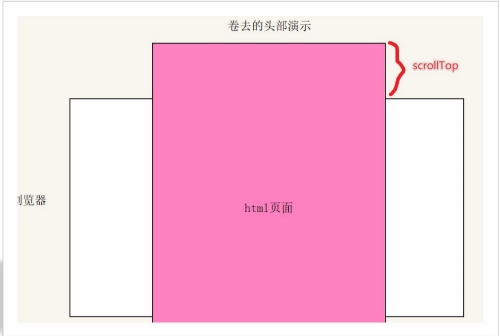

# 09-页面滚动事件

- 滚动条在滚动时**持续触发**的事件
- 使用场景: 检测用户把页面滚动到某个区域时,做一些处理.比如固定导航栏/加载更多等
- 事件名: `scroll`
- 监听整个页面滚动: `window.addEventListener('scroll',function(){})`
- 通常这个事件加给`window`或者`document`上
- 监听某个元素的内部滚动直接给某个元素加即可
  - 注意: `overflow`属性必须是`scroll`或者`auto`才能触发滚动事件

## 1. 获取滚动的距离

- 谁滚动?
  - 是整个页面在滚动,即整个HTML文档滚动
  - HTML文档: `document.documentElement`

- 滚动了多少距离?
  - `scrollTop`/`scrollLeft`
  - 获取被卷去的头部距离和左边距离
  - 这两个属性表示的是元素内容往上/左滚出去看不到的距离
  - 这两个属性是**可读写**的

