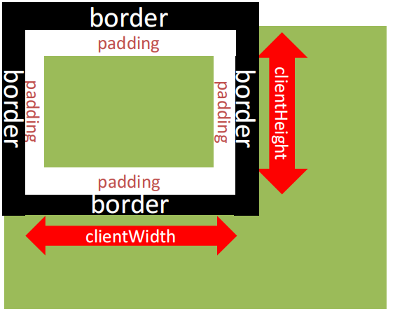

# 12-页面尺寸事件

- 在窗口尺寸改变时触发的事件
- 事件名: `resize`
- `window.addEventListener('resize', function() {})`
- 使用场景: 获取窗口大小

## 1. 获取元素宽高

- 可视区域: 元素的宽高(不包含border/margin/滚动条部分)
  - 注意: 包含padding

- `DOM.clientWidth`: 元素可视区域的宽度
- `DOM.clientHeight`: 元素可视区域的高度

