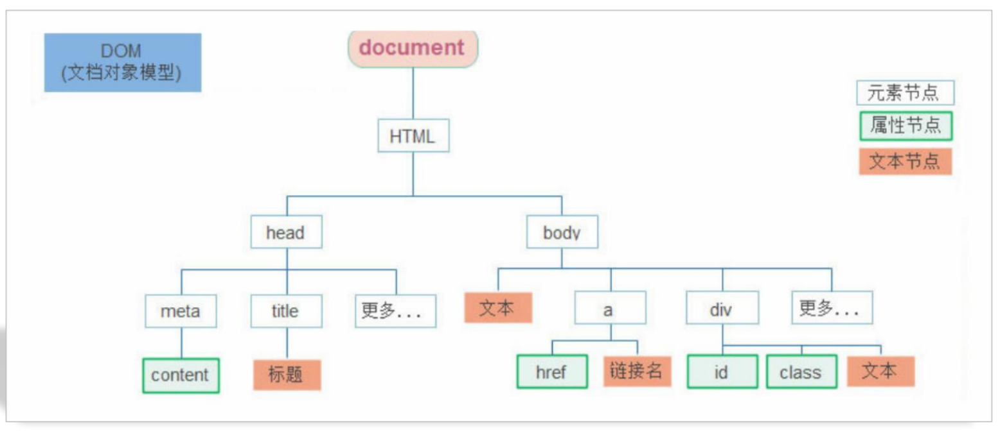

# 06-DOM树及节点

- DOM树: DOM将HTML文档以树状结构直观的表现出来,我们称之为DOM树或者节点树
- 节点(Node): 是DOM树(节点树)中的单个点.包括文档本身/元素/文本以及注释都属于是节点
  - 元素节点(重点):
    - 所有的标签,比如`body`/`div`
    - `html`是根节点
  - 属性节点
    - 所有的属性,比如`href`/`src`
  - 文本节点
    - 标签中的文本内容