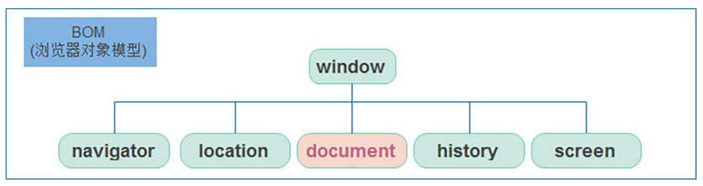

# 01-window对象

- DOM(Document Object Model): 文档对象模型,定义了一套操作HTML文档的API
- BOM(Browser Object Model): 浏览器对象模型,定义了一套操作浏览器的API
- 注意: DOM不是BOM的一部分,虽然从代码上来讲,可以认为BOM是在操作`window`对象,DOM是在操作`window.document`对象,但二者是彼此独立的,并不存在从属关系

## 1. window对象

- `window`对象是一个全局对象,也可以说是JavaScript中的顶级对象
- 像`document`/`alert()`/`console.log()`这些都是`window`对象的属性或方法,基本BOM的属性和方法都是window的
- 所有通过`var`关键字定义在全局作用域中的变量/函数,都会成为`window`对象的属性/方法
- `window`对象的属性和方法在调用时可以省略`window.`前缀