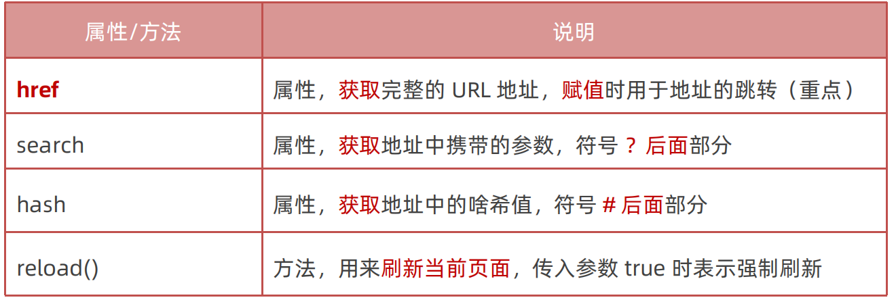

# 04-location对象

- `window.location`: 该对象拆分并保存了当前文档的URL的各个部分

- `location.href`: 获取或设置当前文档的URL
  - 例如: `location.href = 'http://www.baidu.com'`
  - 可以用于页面的跳转
- `location.reload(true)`: 强制刷新页面,传入true参数表示强制**从服务器重新加载**页面,通常用于规避本地缓存
  - 注意: 由于这一点,如果直接写这行代码,页面会不断刷新,这是因为每次刷新都会重新加载,而重新加载又会再次执行这行代码