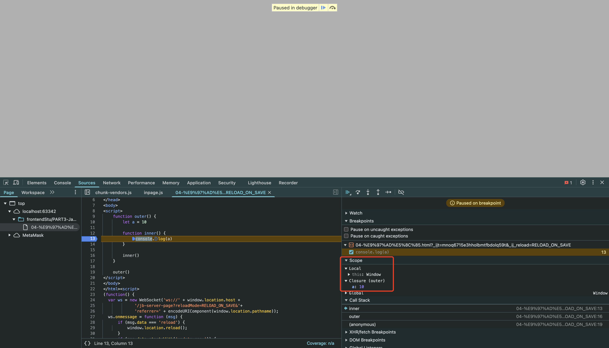

# 04-闭包

- 闭包: 一个函数对周围状态的引用捆绑在一起,闭包让开发者可以从内部函数访问外部函数的作用域



- 闭包的作用: 实现**数据的私有**和**封装**,避免全局污染

- 例: 统计函数调用次数

```javascript
let counter = 0

function call() {
    counter++
    console.log(counter)
}

call()
call()
```

这个实现有一个问题: `counter`是全局变量,容易被修改,不安全

- 解决方法: 使用闭包(**函数也是一种数据类型**)

```javascript
    function call() {
        let counter = 0
        function count () {
            counter++
            console.log(counter)
        }
        
        return count
    }
    
    let count = call()
    count()
    count()
```

- 这样就保证了变量`counter`的安全性,外部无法直接访问