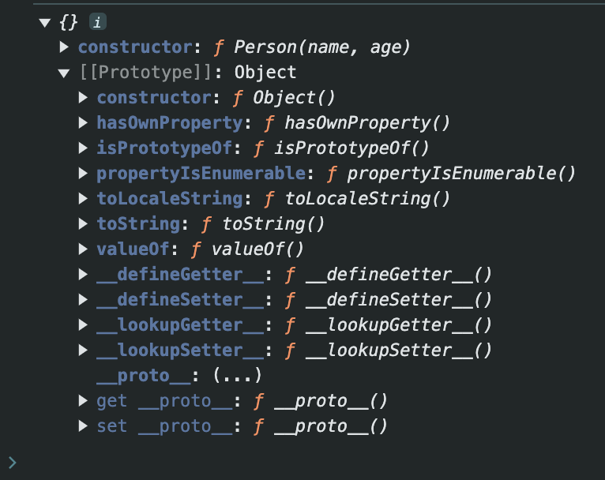
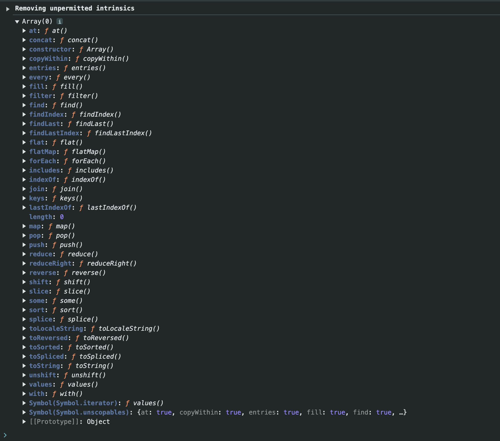

# 03-prototype对象

- JS中,每个函数都有一个prototype属性,这个属性是一个对象
- 使用场景: 解决构造函数中,多次创建相同方法的问题
- 使用方式: 将方法添加到prototype属性中,这样多个实例对象就可以共享这个方法,不会重复创建了

```javascript
function Person(name, age) {
    this.name = name
    this.age = age
}

Person.prototype.say = function () {
    // 这里的this指向调用say方法的对象 也就是Person实例
    console.log(this.name + ' ' + this.age)
}

let p1 = new Person('Tom', 18)
let p2 = new Person('Jerry', 20)
console.log(p1.say === p2.say) // true
```

- 实例可以直接访问原型对象中的属性和方法
- 执行过程: 先找实例对象中是否有该属性或方法,如果没有,再去原型对象中查找
- 注意:
  - **原型中的`this`指向调用该方法的实例对象**
  - **构造函数不能用箭头函数,因为箭头函数没有`this`,会指向全局对象**

- 原型对象的结构:

```javascript
function Person(name, age) {
        this.name = name
        this.age = age
    }
    
    console.log(Person.prototype)
```



- 像之前学的一些方法`arr.push()`,这些方法都是通过原型对象添加的

```javascript
console.log(Array.prototype)
```



- 原型对象的作用:
  - 可以把公共的属性和方法,直接定义在prototype对象上
  - 实例可以直接访问原型对象中的属性和方法
  - 这些属性和方法不会多次创建,节省内存