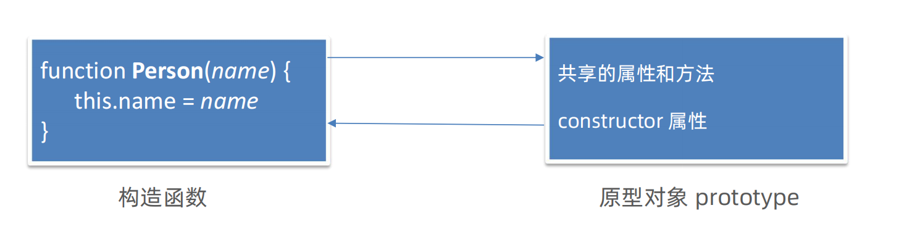

# 05-constructor属性介绍

- constructor属性: 每个prototype对象都有一个constructor属性,指向该prototype对象的构造函数



```javascript
function Person(name, age) {
    this.name = name
    this.age = age
}

console.log(Person.prototype.constructor === Person) // true
```

- 使用场景: 通过constructor属性判断对象的类型

```javascript
    function Person(name, age) {
    this.name = name
    this.age = age
}

let person = new Person('Tom', 18)
// 使用typeof关键字只能判断基本数据类型,无法判断对象的具体类型
console.log(typeof person) // object

// constructor属性可以判断对象的具体类型
console.log(person.constructor === Person) // true
```

- 使用场景: 当使用对象形式为prototype对象赋值时,需要手动指定constructor属性

现有如下代码:

```javascript
function Person(name, age) {
    this.name = name
    this.age = age
}

Person.prototype.say = function () {
    console.log('我是' + this.name + '，今年' + this.age + '岁')
}

Person.prototype.sing = function () {
    console.log('我是' + this.name + ', 我会唱歌')
}
```

当使用对象形式为prototype对象赋值时,需要手动指定constructor属性:

```javascript
function Person(name, age) {
    this.name = name
    this.age = age
}

Person.prototype = {
    // 手动指定constructor属性
    constructor: Person,
    say: function () {
        console.log('我是' + this.name + '，今年' + this.age + '岁')
    },
    sing: function () {
        console.log('我是' + this.name + ', 我会唱歌')
    }
}
```