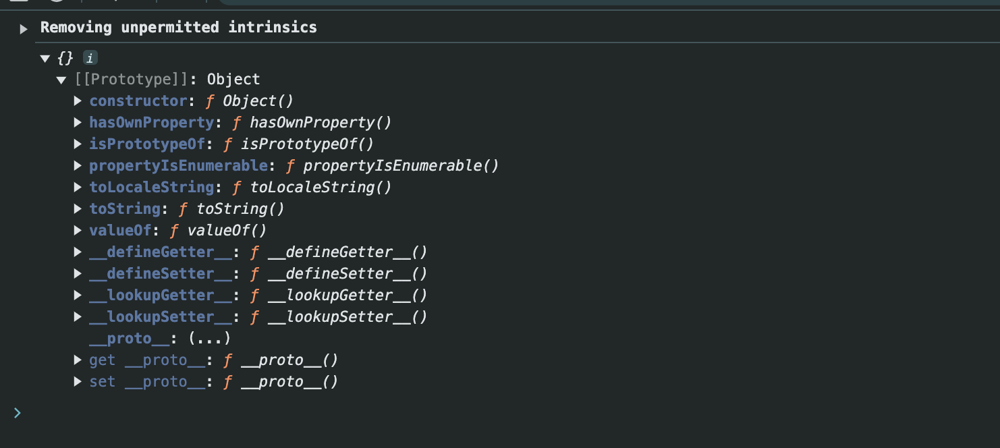
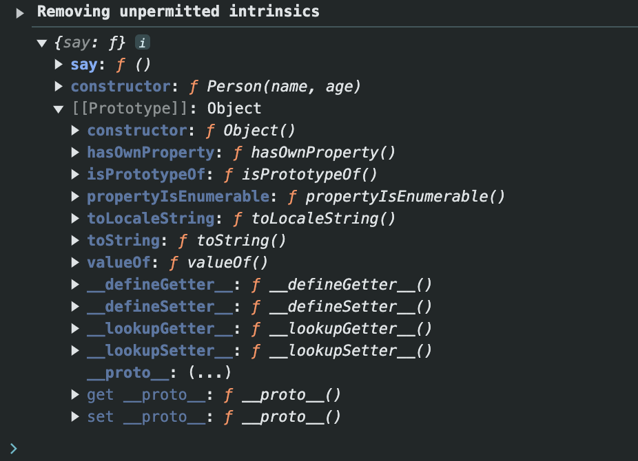

# 06-原型介绍

- 原型: 对象都有一个名为`__proto__`的属性,这个属性指向对象的构造函数的prototype对象
- 之所以实例可以调用到定义在构造函数的prototype对象上的属性和方法,是因为实例的`__proto__`属性指向构造函数的prototype对象

```javascript
function Person(name, age) {
    this.name = name
    this.age = age
}

Person.prototype.say = function () {
    console.log('我是' + this.name + '，今年' + this.age + '岁')
}

let p1 = new Person('张三', 18)
console.log(p1.__proto__)
console.log(p1.__proto__ === Person.prototype) // true
```

- 注意: `__proto__`原来是JS的非标准属性,但是在ES6中开始标准化,`[[Prototype]]`和`__proto__`是等价的
    - `[[Prototype]]`是JavaScript的内部属性,不能直接通过点符号或方括号符号访问.可以使用`Object.getPrototypeOf()`来访问对象的原型
    - ES6推荐使用`Object.getPrototypeOf()`来获取对象的原型;`Object.setPrototypeOf()`来设置对象的原型

```javascript
function Person(name, age) {
    this.name = name
    this.age = age
}

Person.prototype.say = function () {
    console.log('我是' + this.name + '，今年' + this.age + '岁')
}

let p1 = Object.create({})
console.log(Object.getPrototypeOf(p1)) // Object实例的__proto__属性

Object.setPrototypeOf(p1, Person.prototype)
console.log(Object.getPrototypeOf(p1)) // Person构造函数的prototype对象

p1.name = '张三'
p1.age = 18
p1.say()
```





- 注意: 
  - 约定上,将`prototype`对象称为原型对象,将`__proto__`属性称为原型
  - **尽量不要修改`__proto__`,否则会影响性能**
  - `__proto__`是非标准属性,在现代浏览器里面显示的是`[[Prototype]]`,但二者等价