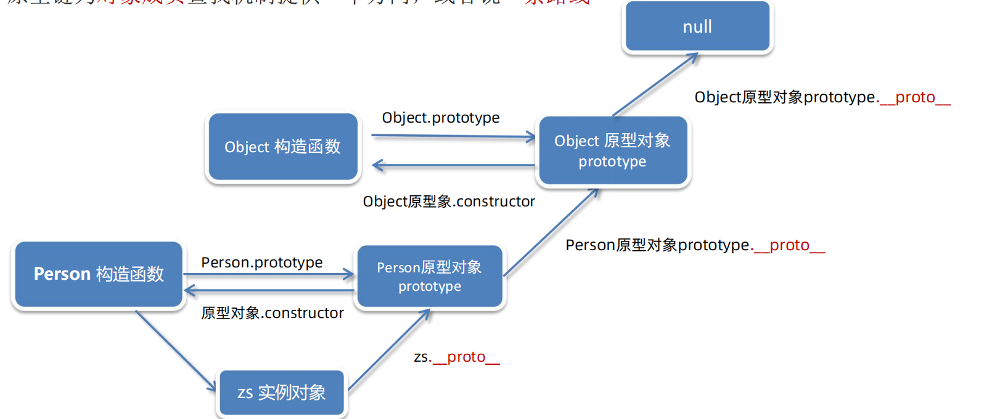

# 08-原型链



- 作用: 为对象成员查找机制提供一个方向,或者说提供了一个路径
- 查找规则:
  - step1. 当访问一个对象成员(属性/方法)时,首先在**当前对象**中查找,如果找到则直接使用
  - step2. 如果当前对象中没有找到,则查找**当前对象的`__proto__`属性所指向的对象**中查找,如果找到则直接使用
  - step3. 如果当前对象的`__proto__`属性所指向的对象中没有找到,则查找**当前对象的`__proto__`属性所指向的对象的`__proto__`属性所指向的对象**中查找,如果找到则直接使用
  - step4. 依次类推,直到找到`Object.prototype.__proto__`为null为止
    - 因为顺着`__proto__`属性查找对象,最终会查找到`__proto__`属性为`Object.prototype`的对象,而`Object.prototype`的`__proto__`属性为null

```javascript
function Person(name, age) {
    this.name = name
    this.age = age
}

Person.prototype.say = function () {
    console.log('定义在Person.prototype上的say()方法')
}

let p1 = new Person('Tom', 18)
p1.say = function () {
    console.log('定义在p1这个Person实例上的say()方法')
}

p1.say()
```

运行结果: `定义在p1这个Person实例上的say()方法`

```javascript
function Person(name, age) {
    this.name = name
    this.age = age
}

Person.prototype.say = function () {
    console.log('定义在Person.prototype上的say()方法')
}

let p1 = new Person('Tom', 18)

p1.say()
```

运行结果: `定义在Person.prototype上的say()方法`

```javascript
function Person(name, age) {
    this.name = name
    this.age = age
}

console.log(Person.prototype.__proto__ === Object.prototype) // true

// 由于Person.prototype.__proto__ 直接指向了Object.prototype
// 所以这里我就直接把say方法定义在Object.prototype上
Object.prototype.say = function () {
    console.log('定义在Object.prototype上的方法')
}

let person = new Person('why', 18)
person.say()
```

运行结果: `定义在Object.prototype上的方法`
