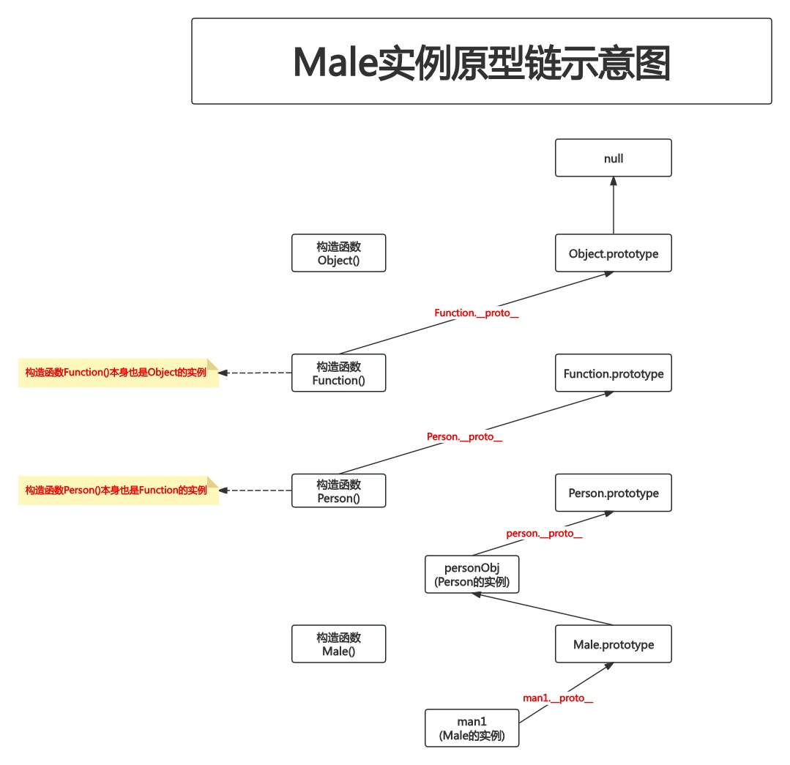
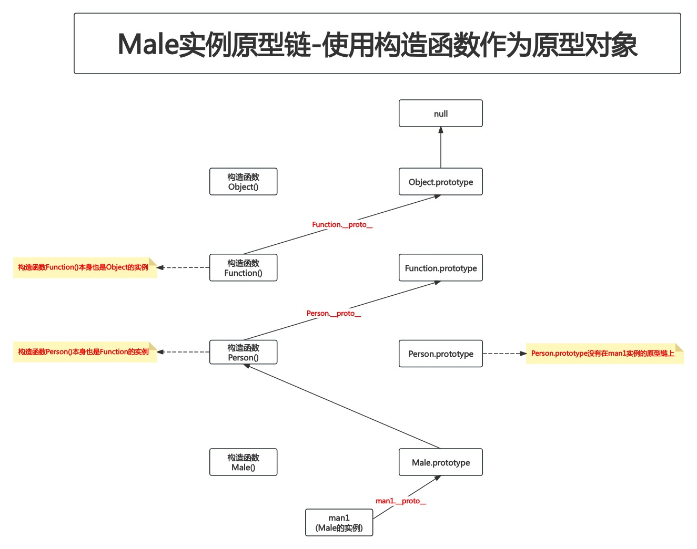

# 10-使用原型实现继承

## 1. 问题的产生

```javascript
function Male(name, age) {
    this.name = name
    this.age = age
}

Male.prototype.eat = function () {
    console.log('eat sth')
}

function Female(name, age) {
    this.name = name
    this.age = age
}

Female.prototype.eat = function () {
    console.log('eat sth')
}
```

## 2. 使用原型对象实现继承

```javascript
function Person(name, age) {
    this.name = name
    this.age = age
}

Person.prototype.eat = function () {
    console.log('eat sth')
}

const personObj = new Person('', 0)

function Male(name, age) {}
Male.prototype = personObj

function Female(name, age) {}
Female.prototype = personObj

let man1 = new Male('kobe', 41)
// instanceof 运算符用于检测构造函数的prototype对象 是否存在于该对象的的原型链上
console.log(man1 instanceof Male)       // true
console.log(man1 instanceof Person)     // true

console.log(typeof Person.__proto__)    // function
console.log(Object.getPrototypeOf(Person) === Function.prototype)   // true

man1.eat()      // eat sth
```



## 3. 使用原型对象实现继承的问题

- 当为Male添加成员时,会影响到Female

```javascript
function Person(name, age) {
    this.name = name
    this.age = age
}

Person.prototype.eat = function () {
    console.log('eat sth')
}

const personObj = new Person('', 0)

function Male(name, age) {}
Male.prototype = personObj
Male.prototype.drinkAlcohol = function () {
    console.log('drink alcohol')
}

function Female(name, age) {}
Female.prototype = personObj

let male1 = new Male('kobe', 41)
let female1 = new Female('lucy', 18)
male1.drinkAlcohol()

// 问题：female1也可以调用drinkAlcohol()方法
female1.drinkAlcohol()
```

## 4. 使用原型对象实现继承的解决方案

- 每个构造函数使用各自的原型对象,不再共享一个原型对象

```javascript
function Person(name, age) {
    this.name = name
    this.age = age
}

Person.prototype.eat = function () {
    console.log('eat sth')
}

function Male(name, age) {}
Male.prototype = new Person()
Male.prototype.drinkAlcohol = function () {
    console.log('drink alcohol')
}

function Female(name, age) {}
Female.prototype = new Person()

let male1 = new Male('kobe', 41)
male1.drinkAlcohol()

let female1 = new Female('lucy', 18)
console.log(female1.drinkAlcohol === undefined) // true
```

## 5. 题外话-将原型对象修改为构造函数

```javascript
function Person(name, age) {
    this.name = name
    this.age = age
}

Person.prototype.eat = function () {
    console.log('eat sth')
}

function Male(name, age) {}
Male.prototype = Person

function Female(name, age) {}
Female.prototype = Person

let man1 = new Male('kobe', 41)
// instanceof 运算符用于检测构造函数的prototype对象 是否存在于该对象的的原型链上
console.log(man1 instanceof Male)       // true
console.log(man1 instanceof Person)     // false

console.log(typeof Person.__proto__)    // function
console.log(Object.getPrototypeOf(Person) === Function.prototype)   // true

man1.eat()  // Uncaught TypeError: man1.eat is not a function
```

