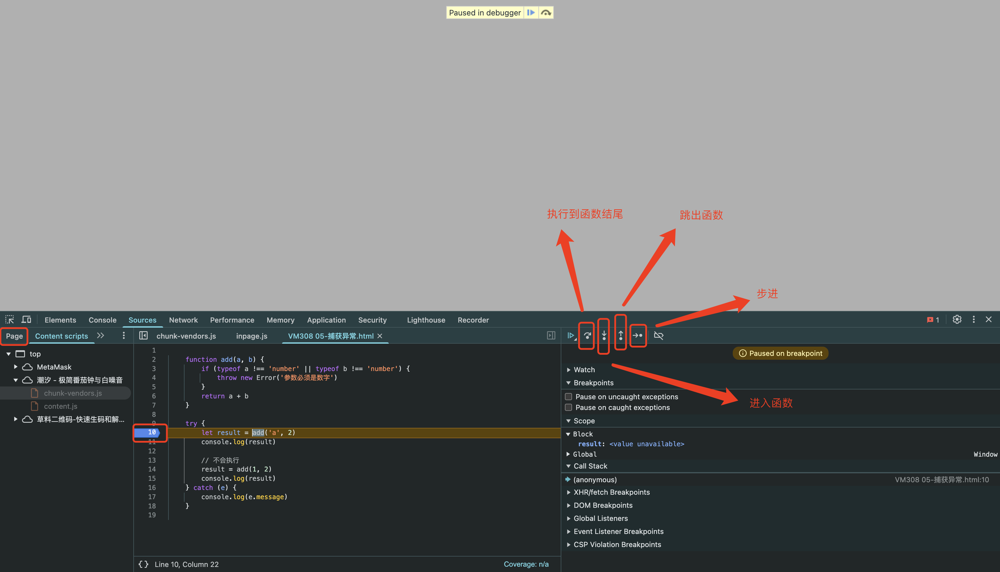

# 05-异常处理

## 1. 抛出异常

- `Error`对象: 用于抛出用户自定义的异常
- `throw`语句: 抛出异常

```javascript
function add(a, b) {
    if (typeof a !== 'number' || typeof b !== 'number') {
        throw new Error('参数必须是数字')
    }
    return a + b
}
```

## 2. 捕获异常

- `try...catch...finally`语句: 捕获异常
    - `try`代码块: 尝试执行的代码,这个代码块中,一旦发生异常,就会立即终止执行,转而执行`catch`代码块
    - `catch`代码块: 捕获异常后执行的代码
    - `finally`代码块: 无论是否发生异常,都会执行的代码
      - 一般`finally`代码块用于做加载动画,关闭文件等操作

```javascript
function add(a, b) {
    if (typeof a !== 'number' || typeof b !== 'number') {
        throw new Error('参数必须是数字')
    }
    return a + b
}

try {
    let result = add('a', 2)
    console.log(result)

    // 不会执行
    result = add(1, 2)
    console.log(result)
} catch (e) {
    console.log(e.message)
} finally {
    console.log('无论是否抛出异常,都会执行')
}
```

