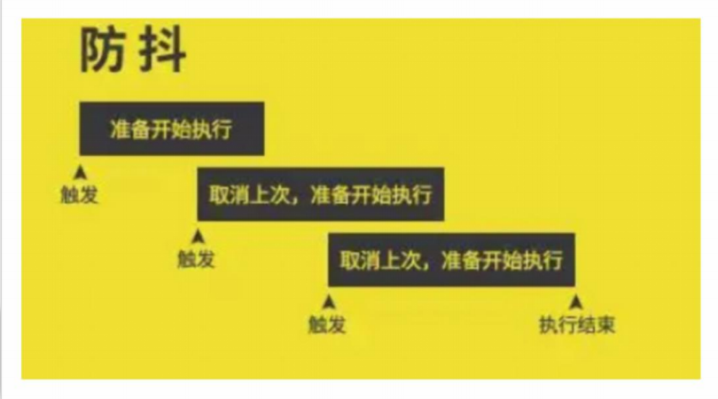

# 07-性能优化-防抖

## 1. 防抖

- 防抖(debounce): 在事件触发后,不会立即执行,而是等待一段时间.若在此期间内事件再次触发,则重新计时
  - 最终的效果是只执行了最后一次事件处理函数



- 使用场景:
  - 输入框实时搜索: 当用户输入的间隔超过阈值时,再发送请求
  - 窗口调整大小: 当用户调整窗口大小时,不会一直触发resize事件,而是等待用户调整完成后再触发

## 2. 问题的产生

- 需求: 鼠标滑过盒子时,数字+1

```javascript
const box = document.querySelector('.box')
let counter = 0
box.innerHTML = counter + ''
box.addEventListener('mousemove', mousemoveHandle)

function mousemoveHandle() {
    counter++
    box.innerHTML = counter + ''
}
```

此时,鼠标在盒子上移动,数字会一直增加,因为鼠标移动会触发多次事件,导致数字一直增加

因此更改需求为: 鼠标滑过盒子时,数字+1,**但是只有在鼠标停止移动100ms后,才会增加数字**

## 3. 使用lodash实现防抖

```javascript
const box = document.querySelector('.box')
let counter = 0
box.innerHTML = counter + ''
// 防抖 事件结束后100ms才会执行
box.addEventListener('mousemove', _.debounce(mousemoveHandle, 100))

function mousemoveHandle() {
    counter++
    box.innerHTML = counter + ''
}
```

- [`_.debounce()`方法文档](https://www.lodashjs.com/docs/lodash.debounce)

## 4. 自定义防抖函数

思路:

- 声明一个用于记录定时器id的变量
- 每次鼠标移动时:
  - 先判断定时器是否存在
    - 如果定时器存在,则清除定时器
    - 创建一个新的定时器,并保存定时器id

```javascript
const box = document.querySelector('.box')
let counter = 0
box.innerHTML = counter + ''
box.addEventListener('mousemove', debounce(mousemoveHandle, 100))

function debounce(fn, delay) {
    let timerId
    
    return function () {
        if (timerId !== undefined) {
            clearTimeout(timerId)
        }
        timerId = setTimeout(fn, delay)
    }
}

function mousemoveHandle() {
    counter++
    box.innerHTML = counter + ''
}
```