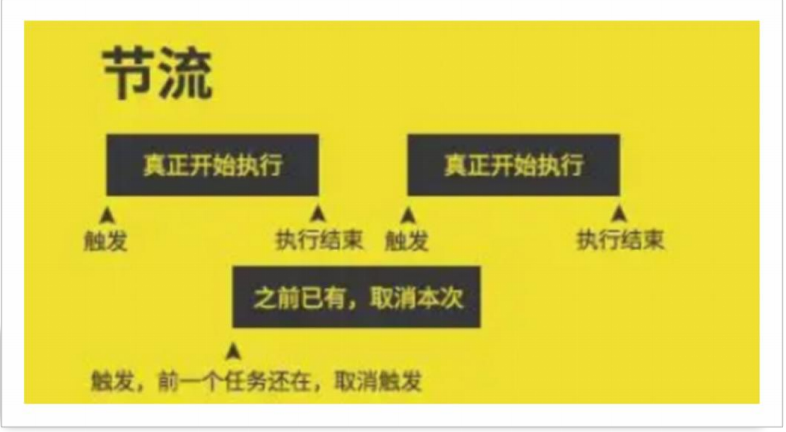

# 08-性能优化-节流

## 1. 节流

- 节流(throttle): 在事件触发后,函数立即执行.但是在给定的时间间隔内,不会再次执行
    - 最终的效果是在给定的时间间隔内,只执行第一次事件处理函数
- 节流与防抖的区别:
    - 节流: 在给定的时间间隔内,只执行第一次事件处理函数
    - 防抖: 在给定的时间间隔内,只执行最后一次事件处理函数
- 



## 2. 问题的产生

- 需求: 鼠标滑过盒子时,数字+1

```javascript
const box = document.querySelector('.box')
let counter = 0
box.innerHTML = counter + ''
box.addEventListener('mousemove', mousemoveHandle)

function mousemoveHandle() {
    counter++
    box.innerHTML = counter + ''
}
```

此时,鼠标在盒子上移动,数字会一直增加,因为鼠标移动会触发多次事件,导致数字一直增加

因此更改需求为: 鼠标滑过盒子时,数字+1,**但是在鼠标移动期间内,每100ms数字只能增加一次**

## 3. 使用lodash实现节流

```javascript
const box = document.querySelector('.box')
let counter = 0
box.innerHTML = counter + ''
box.addEventListener('mousemove', _.throttle(mousemoveHandle, 100))

function mousemoveHandle() {
    counter++
    box.innerHTML = counter + ''
}
```

## 4. 自定义实现节流

### 4.1 第一种实现方式:使用标量

```javascript
function throttle(fn, delay) {
    let isInThrottle = false
    return function () {
        if (!isInThrottle) {
            // 没有在节流状态下 则执行函数
            fn()
            isInThrottle = true
            // 在此期间都是节流状态
            // 一段时间后恢复
            setTimeout(() => isInThrottle = false, delay)
        }
    }
}
```

### 4.2 第二种实现方式:使用定时器

```javascript
function throttle(fn, delay) {
    let timerId = null
    return function () {
        // 未处于节流状态 则在延迟时间后执行函数
        // 然后关闭定时器 重新将timerId置为null
        if (timerId === null) {
            timerId = setTimeout(function () {
                fn()
                clearTimeout(timerId)
                timerId = null
            }, delay)
        }
    }
}
```