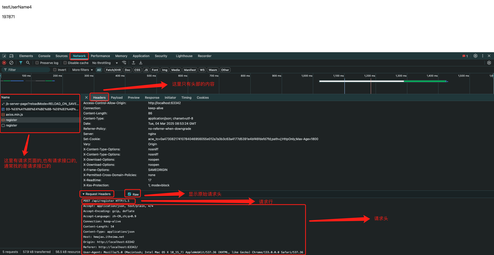
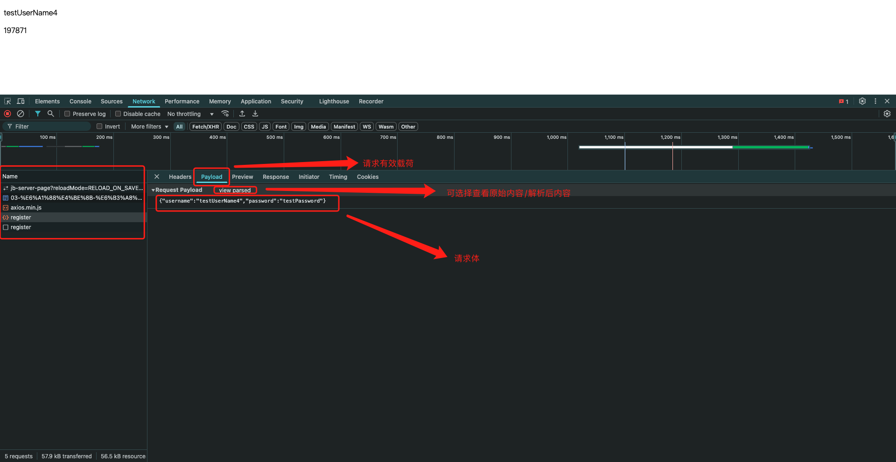
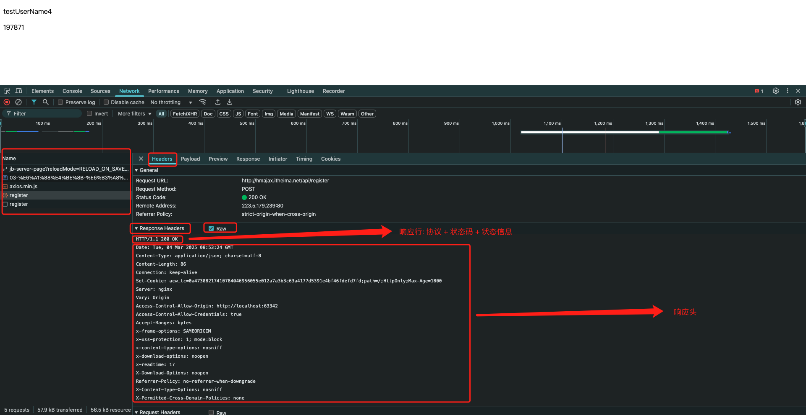
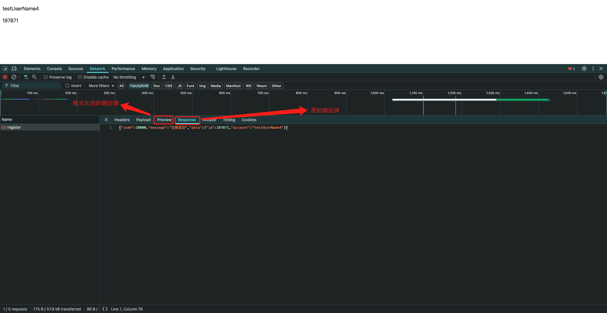
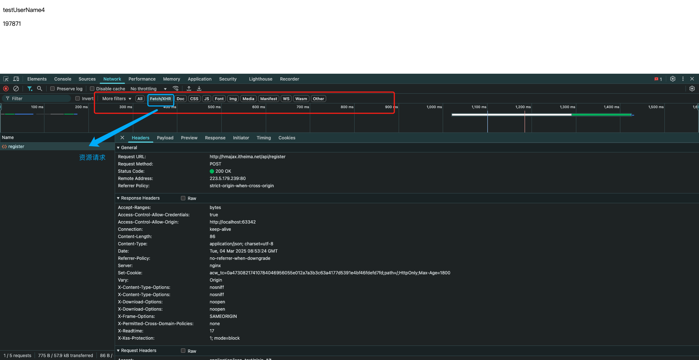

# 05-报文

## 1. 请求报文

- 请求报文结构:
  - 请求行: 请求方法,URL,协议
  - 请求头: 以键值对的格式携带的附加信息,比如`Content-Type`
  - 空行: 分隔请求头,空行之后的是发送给服务器的资源
  - 请求体: 发送的资源

## 2. 响应报文

- 响应报文结构:
  - 响应行: 协议/HTTP响应状态码/状态信息
  - 响应头: 以键值对的格式携带的附加信息,比如`Content-Type`
  - 空行: 分隔响应头,空行之后的是服务器返回的资源
  - 响应体: 返回的资源

## 3. 仅查看资源请求的网络通信

