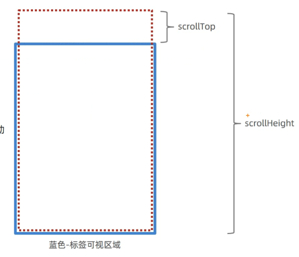

# 10-案例-聊天机器人

## 1. 需求

- 点击发送和敲击回车键,都能发送聊天消息
- 把自己和对方消息都展示到页面上
- 当聊天消息出现滚动条时,始终让最后一条消息出现在视口范围内

## 2. 实现

- API地址: `http://hmajax.itheima.net/api/robot`
- 查询参数:
  - `spoken`
- 请求方式: `GET`
- `DOM.scrollHeigh`：元素的滚动高度

### 2.1 设置滚动

以下是通用做法:

- step1. 给要自动滚动到底部的元素设置`overflow: auto;`
- step2. `滚动距离 = 高度变化的元素.scrollHeight`