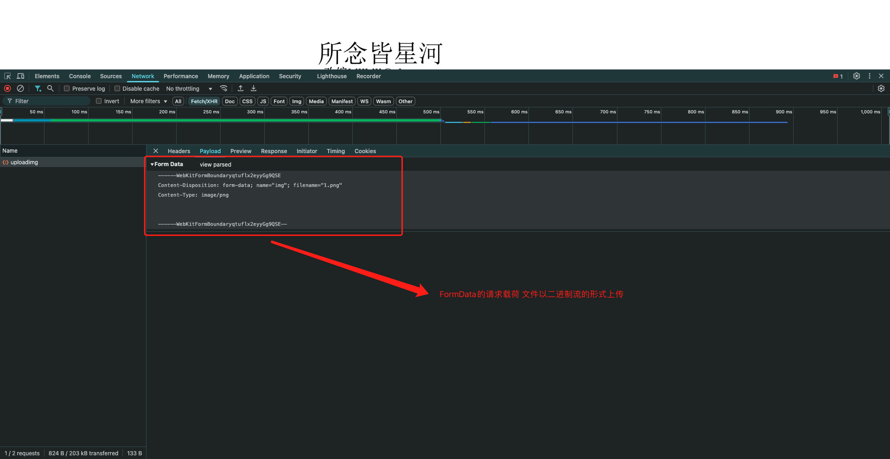

# 03-文件上传

- 文件上传框: `change`事件表示文件选择框内容发生变化时触发,放在文件上传框上就表示选择了文件就会触发事件
- 在该事件中: `event.target.files`可以获取到文件对象,是一个伪数组(因为可以选择多个文件),其中的每一项就表示一个文件对象
  - `file.size`的单位是字节
- `multipart/form-data`格式的使用: `new FormData()`创建一个`FormData`对象,然后使用`append`方法添加键值对,键是后台接收的参数名,值是文件对象
- 想要看到`FormData`对象中的内容,可以使用`for...of`循环遍历`FormData.entries()`,每一项是一个数组,第一项是键,第二项是值

