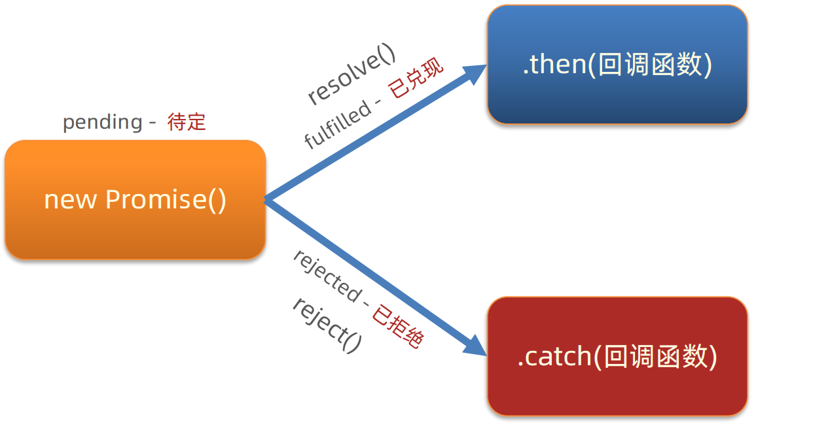

# 02-Promise

## 1. Promise的基本使用

- `Promise`: 该对象用于表示一个异步操作的最终完成或失败及其结果值
  - 注意: 该对象本身并不是异步的,只是用于处理异步操作的结果
  - 可以认为`Promise`对象是`fork-join`模型中的`join`点

```javascript
// Promise对象的构造函数接收一个函数作为参数 当Promise对象的状态发生变化时 会调用这个函数
const promise = new Promise((resolve, reject) => {
    // 执行异步任务
    // ...(异步任务代码)
    // 当异步任务执行成功时 调用resolve方法 将异步任务的结果传递给外部
    resolve('success')
})

// then()方法中的回调函数会在promise对象的状态变为resolved时被调用
// catch()方法中的回调函数会在promise对象的状态变为rejected时被调用
// 换言之
// then()方法中的回调函数即为 上一行代码中的resolve
// catch()方法中的回调函数即为 上一行代码中的reject
promise.
then((result) => console.log(result)).
catch((error) => console.log(error))
```

- 注意示例代码中的`resolve('success')`,这表示在异步任务中,将执行结果传递给了异步任务外边
    - 注意`resolve()`函数的定义是在`new Promise()`外定义的

## 2. Promise的状态

- `Promise`对象有三种状态: `pending`/`fulfilled`/`rejected`
    - `pending`: 初始状态,既不是成功状态,也不是失败状态
    - `fulfilled`: 意味着操作成功完成
    - `rejected`: 意味着操作失败
- 注意: `Promise`对象的状态一旦被改变,就不会再变.这种现象被称为状态凝固



### 2.1 fulfilled

```javascript
const promise = new Promise((resolve, reject) => {
    setTimeout(() => {
        // 调用resolve函数 就会将Promise状态修改为fulfilled
        // 传递给resolve函数或reject函数的实参值 即为Promise.PromiseResult属性值
        resolve('模拟AJAX请求-响应成功')
        console.log(promise)    // Promise {<fulfilled>: "模拟AJAX请求-响应成功"}
    }, 2000)
})

console.log(promise)    // Promise {<pending>}

promise.
then(resolve => console.log(resolve)).
catch(reject => console.log(reject))
```

### 2.2 rejected

```javascript
const promise = new Promise((resolve, reject) => {
    setTimeout(() => {
        // 调用reject函数 就会将Promise的状态修改为rejected
        reject('模拟AJAX请求-响应失败')
        console.log(promise)    // Promise {<rejected> "模拟AJAX请求-响应失败"}
    }, 2000)
})

console.log(promise)    // Promise {<pending>}

promise.
then(resolve => console.log(resolve)).
catch(reject => console.log(reject))
```

### 2.3 状态凝固

- `Promise`对象的状态一旦被修改,就不会再改变
- 且不会再执行另外一个状态的回调函数

```javascript
const promise = new Promise((resolve, reject) => {
    setTimeout(() => {
        reject('模拟AJAX请求-响应失败')
        // Promise对象的状态一旦修改,就不会再改变
        // 且一旦状态被修改 就不会执行另一个状态的回调函数
        resolve('模拟AJAX请求-响应成功')

        // 因此此处的状态仍然为rejected 且Promise.PromiseResult的值为 "模拟AJAX请求-响应失败"
        console.log(promise)    // Promise {<rejected>: "模拟AJAX请求-响应失败"}
    }, 2000)
})

console.log(promise)    // Promise {<pending>}

promise.
then(resolve => console.log(resolve)).
catch(reject => console.log(reject))
```

## 3. 使用Promise + XHR实现AJAX请求

- 发送请求并接收响应是一个异步任务,因此可以使用`Promise`对象来实现
- 响应成功调用`resolve()`函数
- 响应失败调用`reject()`函数

### 3.1 自己的实现

```javascript
const xhr = new XMLHttpRequest()
const url = 'https://hmajax.itheima.net/api/province'
xhr.open('GET', url)
xhr.addEventListener('loadend', handleResponse)

function handleResponse() {
    const responseObj = JSON.parse(xhr.response)
    renderResponse(responseObj)
}

function renderResponse(responseObj) {
    const provinces = responseObj.list
    const ul = document.createElement('ul')
    provinces.forEach(province => {
        const li = document.createElement('li')
        li.textContent = province
        ul.appendChild(li)
    })
    document.body.appendChild(ul)
}

xhr.addEventListener('error', handleError)

function handleError() {
    console.log(xhr.status)
    console.log(xhr.responseText)
}

const promise = new Promise((resolve, reject) => {
    xhr.send()
    if (xhr.status === 200) {
        resolve()
    }

    reject()
})

promise.
then(handleResponse).
catch(handleError)

console.log(promise)    // Promise {<rejected>: undefined}
```

### 3.2 自己实现的问题

- 现象: 响应确实渲染了,但是在`Promise`的构造函数中,调用到了`reject()`函数,打印了响应状态码为0
- 原因:
  - `Promise`构造函数中的代码是同步执行的,不是异步的,在`xhr.send()`之后立即检查响应状态码,此时响应还未返回,因此状态码为0
- 其他错误:
  - 应该分别监听`load`和`error`事件,而不是`loadend`事件
    - 更完备的做法是再监听`abort`事件(取消请求)
- 正解:
  - 在`Promise`构造函数的内部监听`xhr`的`load`事件和`error`事件
    - 在`load`事件中调用`resolve()`函数,渲染响应
    - 在`error`事件中调用`reject()`函数,打印错误信息

```javascript
const xhr = new XMLHttpRequest()
const url = 'https://hmajax.itheima.net/api/province'
xhr.open('GET', url)

function renderResponse(responseObj) {
    const provinces = responseObj.list
    const ul = document.createElement('ul')
    provinces.forEach(province => {
        const li = document.createElement('li')
        li.textContent = province
        ul.appendChild(li)
    })
    document.body.appendChild(ul)
}

function handleError(error) {
    console.log(error.message)
}

const promise = new Promise((resolve, reject) => {
    xhr.addEventListener('load', () => {
        try {
            const responseObj = JSON.parse(xhr.response)
            resolve(responseObj)
        } catch (error) {
            const responseErr = new Error(`请求失败，状态码为${xhr.status}, 错误信息为${xhr.responseText}`)
            reject(responseErr)
        }
    })
    
    xhr.addEventListener('error', () => {
        const responseErr = new Error(`请求失败，状态码为${xhr.status}, 错误信息为${xhr.responseText}`)
        reject(responseErr)
    })
    
    xhr.send()
})

promise.
then(responseObj => renderResponse(responseObj)).
catch(error => handleError(error))

console.log(promise)
```