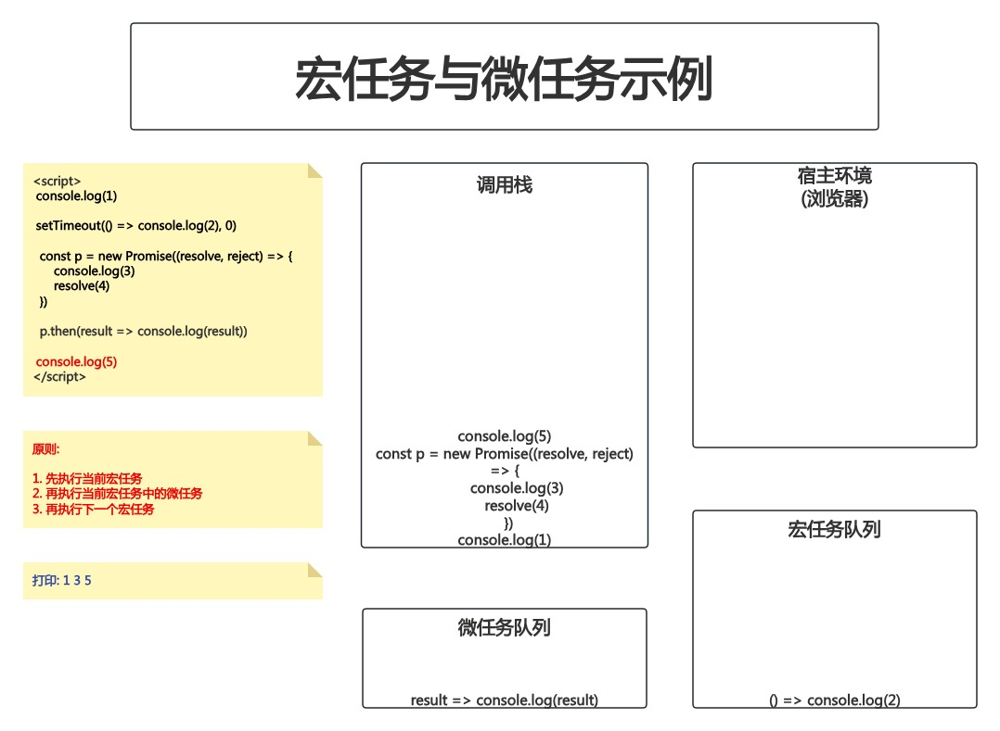

# 04-事件循环-EventLoop

## 1. 事件循环-Event Loop

- 概念: JS中有一个基于**事件循环**的并发模型,事件循环负责执行代码、收集和处理事件、执行队列中的子任务
- 原因: JS是单线程的,为了避免阻塞,采用事件循环机制
    - 先执行同步任务,再执行异步任务
- 同步任务在JS的调用栈中执行,异步任务放在宿主环境(浏览器)中执行
    - 当定时器到时、事件触发、Ajax请求完成时,宿主环境会将异步任务放入任务队列中
    - 当调用栈中的同步任务执行完毕,会去任务队列中查看是否有任务,有则放入调用栈中执行
    - 这个机制称为事件循环(Event Loop)
- 定义: 事件循环是一个用于执行代码和收集异步任务的模型,当调用栈空闲时,会去任务队列中查看是否有任务,有则放入调用栈中执行


注意图中的:

```javascript
setTimeout(() => {
    console.log(2)
}, 0)
```

在宿主环境中,它是:

```javascript
setTimeout(() => {
    console.log(2)
}, 0)
```

但是在任务队列中,只有回调函数进入了任务队列,而`setTimeout`本身并没有进入任务队列:

```javascript
() => {
    console.log(2)
}
```

且由于`setTimeout`的第二个参数是0,所以回调函数会立即进入任务队列

调用栈中的任务执行完毕后,会持续去任务队列中查看是否有任务,有则放入调用栈中执行;没有则类似于轮询,过一段时间再去查看

## 2. 宏任务和微任务

- ES6中引入了`Promise`对象,让JS引擎也可以发起异步任务
- 异步任务分为2种:
    - 宏任务: 由**浏览器**环境执行的异步代码
    - 微任务: 由**JS引擎**环境执行的异步代码

### 2.1 宏任务

- JS脚本执行事件(就是放在`<script>`标签中的JS代码)
- `setTimeout`/`setInterval`
- `AJAX`
- 用户交互事件(`DOM`事件)

### 2.2 微任务

- `Promise.then()`
- `Promise.catch()`
- 注意:**Promise**本身是同步的,但是`then()`和`catch()`这两个**回调函数**是异步的

例:

```html
<script>
    console.log(1)
    
    setTimeout(() => console.log(2), 0)
    
    const p = new Promise((resolve, reject) => {
        console.log(3)
        resolve(4)
    })
    
    p.then(result => console.log(result))
    
    console.log(5)
</script>
```





### 2.3 宏任务与微任务的执行顺序

1. 先执行当前宏任务
2. 再执行当前宏任务中的微任务
3. 再执行下一个宏任务