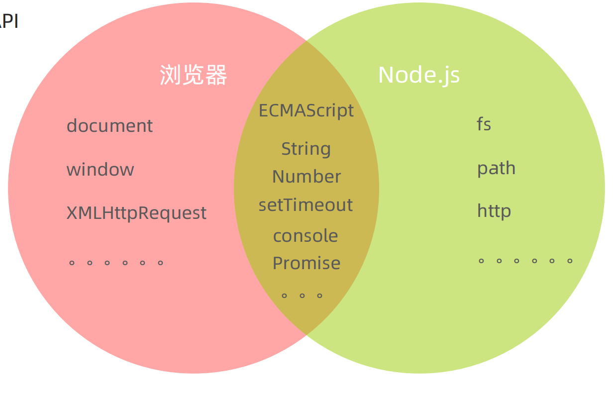

# 01-nodeJS介绍

## 1. 简介

- Node.JS: 是一个基于Chrome V8引擎的JavaScript运行环境.可以用于编写后端应用,也可以用于前端工程化
- 前端工程化: 对代码进行压缩/转译/合并/模块化等处理,使得代码更加高效,便于维护



- Node.js中不支持DOM/BOM,因为DOM/BOM是浏览器提供的;Node.js是基于V8引擎的,所以不支持DOM/BOM
- [下载地址](https://nodejs.org/en/download)
- [历史版本安装包](https://nodejs.org/download/release/)

```
node --version
v22.14.0
```

## 2. 使用node执行js文件

```javascript
console.log('hello nodejs')

for (let i = 0; i < 3; i++) {
    console.log(i)
}
```

```
node 01-使用node执行js文件.js
hello nodejs
0
1
2
```