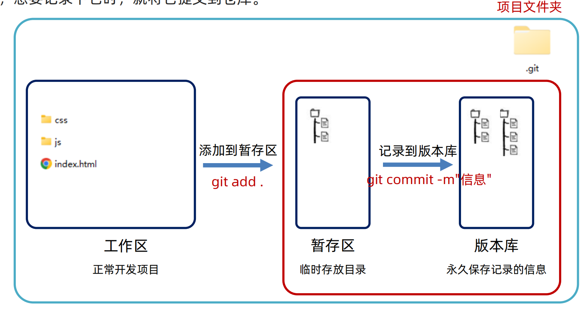
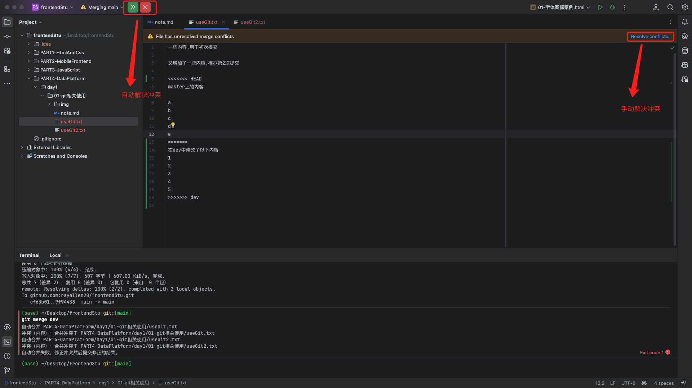
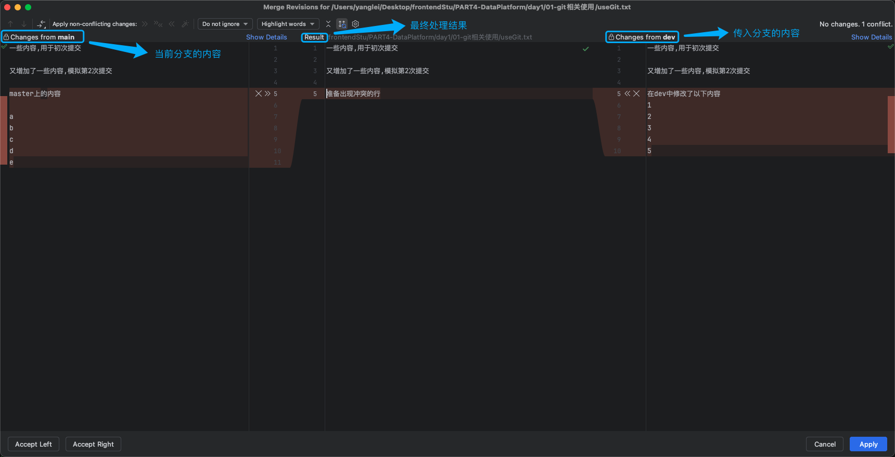

# 01-git相关使用

## 1. 工作区/暂存区与版本库

- 提交代码的过程:

1. 在工作区修改文件
2. 将修改的文件添加到暂存区 
3. 将暂存区的文件提交到版本库

## 2. 查看及切换历史版本

- 查看历史版本
  - `git log`
  - `git log --oneline`
  - `git reflog`
- 切换历史版本
  - `git reset --hard 版本号`
  - 如果需要让远端也回退到这个版本,需要使用强制推送 `git push -f`

## 3. 合并分支

- 先切换到需要合并的分支
- `git merge 要合并的分支名`

## 4. 冲突

- 冲突的产生
  - 当两个分支对同一个文件的同一行进行了修改,合并时就会产生冲窋

- IDE也提供了自动解决冲突的办法
  - 采用当前分支的修改
  - 采用合并分支的修改
  - 保留两者修改

## 4. 删除分支

- `git branch -d`: 删除本地分支
- `git push origin --delete 分支名`: 删除远程分支