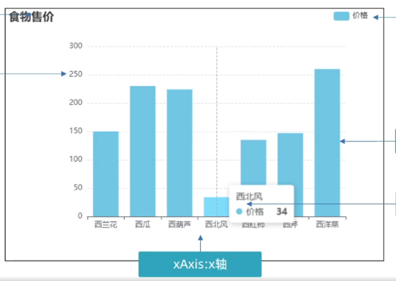
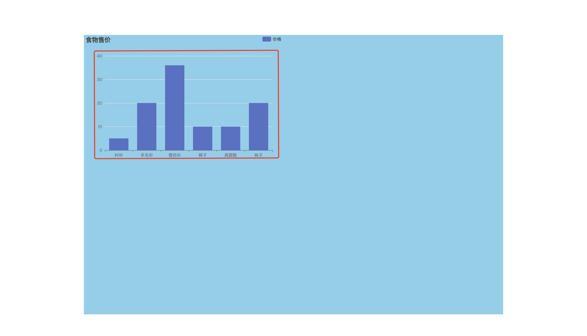

# 01-echarts基础

- [echarts](https://echarts.apache.org/zh/index.html): 一个基于JavaScript的开源可视化库,提供直观,交互丰富,可高度个性化定制的数据可视化图表

## 1. echarts基本使用

## 2. echarts基础配置

```javascript
const option = {
    title: {},      // 标题组件
    legend: {},     // 图例组件
    gird: {},       // 绘图网格
    xAxis: {},      // x轴
    yAxis: {},      // y轴
    tooltip: {},    // 提示框
    series: [],     // 数据项
    color: []       // 颜色列表
}
```

- [配置项手册](https://echarts.apache.org/zh/option.html#title)
- 需求: 将上一节的图表修改为如下样式:



## 2.1 图例

- `legend.data`: 数组.数组中的每个元素表示一个系列的图例
  - `data.name`: 图例表示的系列名称
  - `data.icon`: 图例的图标

```javascript
let option = {
    title: {
        text: '食物售价'
    },
    tooltip: {},
    legend: {
        data: [
            {
                name: '价格',
                // icon: 'image://data:image/gif;base64,R0lGODlhEAAQAMQAAORHHOVSKudfOulrSOp3WOyDZu6QdvCchPGolfO0o/XBs/fNwfjZ0frl3/zy7////wAAAAAAAAAAAAAAAAAAAAAAAAAAAAAAAAAAAAAAAAAAAAAAAAAAAAAAAAAAAAAAACH5BAkAABAALAAAAAAQABAAAAVVICSOZGlCQAosJ6mu7fiyZeKqNKToQGDsM8hBADgUXoGAiqhSvp5QAnQKGIgUhwFUYLCVDFCrKUE1lBavAViFIDlTImbKC5Gm2hB0SlBCBMQiB0UjIQA7',
            }
        ],
        right: 30
    },
    xAxis: {
        data: ['衬衫', '羊毛衫', '雪纺衫', '裤子', '高跟鞋', '袜子']
    },
    yAxis: {},
    series: [
        {
            name: '价格',
            type: 'bar',
            data: [5, 20, 36, 10, 10, 20]
        }
    ]
}
```

### 2.2 网格



- `grid.left`: 网格距容器左侧的距离
  - int值单位为px
  - 字符串表示的百分比表示相对于容器高宽的百分比

```javascript
let option = {
    title: {
        text: '食物售价'
    },
    tooltip: {},
    legend: {
        data: [
            {
                name: '价格',
                // icon: 'image://data:image/gif;base64,R0lGODlhEAAQAMQAAORHHOVSKudfOulrSOp3WOyDZu6QdvCchPGolfO0o/XBs/fNwfjZ0frl3/zy7////wAAAAAAAAAAAAAAAAAAAAAAAAAAAAAAAAAAAAAAAAAAAAAAAAAAAAAAAAAAAAAAACH5BAkAABAALAAAAAAQABAAAAVVICSOZGlCQAosJ6mu7fiyZeKqNKToQGDsM8hBADgUXoGAiqhSvp5QAnQKGIgUhwFUYLCVDFCrKUE1lBavAViFIDlTImbKC5Gm2hB0SlBCBMQiB0UjIQA7',
            }
        ],
        right: 30
    },
    grid: {
        left: '20%',
    },
    xAxis: {
        data: ['衬衫', '羊毛衫', '雪纺衫', '裤子', '高跟鞋', '袜子']
    },
    yAxis: {},
    series: [
        {
            name: '价格',
            type: 'bar',
            data: [5, 20, 36, 10, 10, 20]
        }
    ]
}
```

### 2.3 X轴

- `xAxis.data`: 字符串数组.数组中的每个元素表示一个x轴的刻度名称

```javascript
const foodArr = [
    { name: '西兰花', price: 150 },
    { name: '西瓜', price: 230 },
    { name: '西葫芦', price: 224 },
    { name: '西北风', price: 34 },
    { name: '西红柿', price: 135 },
    { name: '西芹', price: 147 },
    { name: '西洋菜', price: 260 },
]

let option = {
    title: {
        text: '食物售价'
    },
    tooltip: {},
    legend: {
        data: [
            {
                name: '价格',
                // icon: 'image://data:image/gif;base64,R0lGODlhEAAQAMQAAORHHOVSKudfOulrSOp3WOyDZu6QdvCchPGolfO0o/XBs/fNwfjZ0frl3/zy7////wAAAAAAAAAAAAAAAAAAAAAAAAAAAAAAAAAAAAAAAAAAAAAAAAAAAAAAAAAAAAAAACH5BAkAABAALAAAAAAQABAAAAVVICSOZGlCQAosJ6mu7fiyZeKqNKToQGDsM8hBADgUXoGAiqhSvp5QAnQKGIgUhwFUYLCVDFCrKUE1lBavAViFIDlTImbKC5Gm2hB0SlBCBMQiB0UjIQA7',
            }
        ],
        right: 30
    },
    grid: {
        left: '20%',
    },
    xAxis: {
        data: foodArr.map(item => item.name)
    },
    yAxis: {},
    series: [
        {
            name: '价格',
            type: 'bar',
            data: [5, 20, 36, 10, 10, 20]
        }
    ]
}
```

### 2.4 提示框

- `tooltip.trigger`: 提示框触发的条件
  - 'item': 数据项图形触发(鼠标在柱状图的柱子上悬停则触发提示框显示)
  - 'axis': 坐标轴触发(鼠标在坐标轴上悬停则触发提示框显示,说白了这个效果只要鼠标悬停在grid范围内都会触发)
  - 'none': 不触发
- `tooltip.formatter`: 提示框内容格式化

```javascript
const foodArr = [
    { name: '西兰花', price: 150 },
    { name: '西瓜', price: 230 },
    { name: '西葫芦', price: 224 },
    { name: '大葱', price: 34 },
    { name: '西红柿', price: 135 },
    { name: '西芹', price: 147 },
    { name: '西洋菜', price: 260 },
]

let option = {
    title: {
        text: '食物售价'
    },
    tooltip: {
        trigger: 'axis',
        // formatter: '{b0} <br /> {c0}元'
    },
    legend: {
        data: [
            {
                name: '价格',
                // icon: 'image://data:image/gif;base64,R0lGODlhEAAQAMQAAORHHOVSKudfOulrSOp3WOyDZu6QdvCchPGolfO0o/XBs/fNwfjZ0frl3/zy7////wAAAAAAAAAAAAAAAAAAAAAAAAAAAAAAAAAAAAAAAAAAAAAAAAAAAAAAAAAAAAAAACH5BAkAABAALAAAAAAQABAAAAVVICSOZGlCQAosJ6mu7fiyZeKqNKToQGDsM8hBADgUXoGAiqhSvp5QAnQKGIgUhwFUYLCVDFCrKUE1lBavAViFIDlTImbKC5Gm2hB0SlBCBMQiB0UjIQA7',
            }
        ],
        right: 30
    },
    grid: {
        left: '20%',
    },
    xAxis: {
        data: foodArr.map(item => item.name)
    },
    yAxis: {},
    series: [
        {
            name: '价格',
            type: 'bar',
            data: [5, 20, 36, 10, 10, 20]
        }
    ]
}

myChart.setOption(option)
```

### 2.5 Y轴

- `yAxis.axisLine.lineStyle`: 坐标轴轴线相关设置
  - `lineStyle.color`: 坐标轴轴线颜色
  - `lineStyle.width`: 坐标轴轴线宽度
  - `lineStyle.type`: 坐标轴轴线类型
- `yAxis.splitLine.lineStyle`: 坐标轴在grid区域中的分割线
  - `lineStyle.color`: 分割线颜色
  - `lineStyle.width`: 分割线宽度
  - `lineStyle.type`: 分割线类型

```javascript
const foodArr = [
    { name: '西兰花', price: 150 },
    { name: '西瓜', price: 230 },
    { name: '西葫芦', price: 224 },
    { name: '大葱', price: 34 },
    { name: '西红柿', price: 135 },
    { name: '西芹', price: 147 },
    { name: '西洋菜', price: 260 },
]

let option = {
    title: {
        text: '食物售价'
    },
    tooltip: {
        trigger: 'axis',
        // formatter: '{b0} <br /> {c0}元'
    },
    legend: {
        data: [
            {
                name: '价格',
                // icon: 'image://data:image/gif;base64,R0lGODlhEAAQAMQAAORHHOVSKudfOulrSOp3WOyDZu6QdvCchPGolfO0o/XBs/fNwfjZ0frl3/zy7////wAAAAAAAAAAAAAAAAAAAAAAAAAAAAAAAAAAAAAAAAAAAAAAAAAAAAAAAAAAAAAAACH5BAkAABAALAAAAAAQABAAAAVVICSOZGlCQAosJ6mu7fiyZeKqNKToQGDsM8hBADgUXoGAiqhSvp5QAnQKGIgUhwFUYLCVDFCrKUE1lBavAViFIDlTImbKC5Gm2hB0SlBCBMQiB0UjIQA7',
            }
        ],
        right: 30
    },
    grid: {
        left: '20%',
    },
    xAxis: {
        data: foodArr.map(item => item.name)
    },
    yAxis: {
        axisLine: {
            show: true,
            lineStyle: {
                type: 'dashed',
                width: 1,
            }
        },
        splitLine: {
            show: true,
            lineStyle: {
                type: 'dashed',
                width: 1,
            }
        }
    },
    series: [
        {
            name: '价格',
            type: 'bar',
            data: [5, 20, 36, 10, 10, 20]
        }
    ]
}
```

### 2.6 数据项

- `series`: 对象数组.数组中的每个对象表示1个系列的数据
  - `series.name`: 系列名称
  - `series.type`: 系列类型(即图表类型)
  - `series.data`: 系列数据

```javascript
const foodArr = [
    { name: '西兰花', price: 150 },
    { name: '西瓜', price: 230 },
    { name: '西葫芦', price: 224 },
    { name: '大葱', price: 34 },
    { name: '西红柿', price: 135 },
    { name: '西芹', price: 147 },
    { name: '西洋菜', price: 260 },
]

let option = {
    title: {
        text: '食物售价'
    },
    tooltip: {
        trigger: 'axis',
        // formatter: '{b0} <br /> {c0}元'
    },
    legend: {
        data: [
            {
                name: '价格',
                // icon: 'image://data:image/gif;base64,R0lGODlhEAAQAMQAAORHHOVSKudfOulrSOp3WOyDZu6QdvCchPGolfO0o/XBs/fNwfjZ0frl3/zy7////wAAAAAAAAAAAAAAAAAAAAAAAAAAAAAAAAAAAAAAAAAAAAAAAAAAAAAAAAAAAAAAACH5BAkAABAALAAAAAAQABAAAAVVICSOZGlCQAosJ6mu7fiyZeKqNKToQGDsM8hBADgUXoGAiqhSvp5QAnQKGIgUhwFUYLCVDFCrKUE1lBavAViFIDlTImbKC5Gm2hB0SlBCBMQiB0UjIQA7',
            }
        ],
        right: 30
    },
    grid: {
        left: '20%',
    },
    xAxis: {
        data: foodArr.map(item => item.name)
    },
    yAxis: {
        axisLine: {
            show: true,
            lineStyle: {
                type: 'dashed',
                width: 1,
            }
        },
        splitLine: {
            show: true,
            lineStyle: {
                type: 'dashed',
                width: 1,
            }
        }
    },
    series: [
        {
            name: '价格',
            type: 'bar',
            data: foodArr.map(item => item.price)
        }
    ]
}
```

### 2.7 颜色

- `option.color`: 颜色数组.数组中的每个元素表示一个颜色(RBG/十六进制/渐变色/纹理填充)

```javascript
const foodArr = [
    { name: '西兰花', price: 150 },
    { name: '西瓜', price: 230 },
    { name: '西葫芦', price: 224 },
    { name: '大葱', price: 34 },
    { name: '西红柿', price: 135 },
    { name: '西芹', price: 147 },
    { name: '西洋菜', price: 260 },
]

let option = {
    title: {
        text: '食物售价'
    },
    tooltip: {
        trigger: 'axis',
        // formatter: '{b0} <br /> {c0}元'
    },
    legend: {
        data: [
            {
                name: '价格',
                // icon: 'image://data:image/gif;base64,R0lGODlhEAAQAMQAAORHHOVSKudfOulrSOp3WOyDZu6QdvCchPGolfO0o/XBs/fNwfjZ0frl3/zy7////wAAAAAAAAAAAAAAAAAAAAAAAAAAAAAAAAAAAAAAAAAAAAAAAAAAAAAAAAAAAAAAACH5BAkAABAALAAAAAAQABAAAAVVICSOZGlCQAosJ6mu7fiyZeKqNKToQGDsM8hBADgUXoGAiqhSvp5QAnQKGIgUhwFUYLCVDFCrKUE1lBavAViFIDlTImbKC5Gm2hB0SlBCBMQiB0UjIQA7',
            }
        ],
        right: 30
    },
    grid: {
        left: '20%',
    },
    xAxis: {
        data: foodArr.map(item => item.name)
    },
    yAxis: {
        axisLine: {
            show: true,
            lineStyle: {
                type: 'dashed',
                width: 1,
            }
        },
        splitLine: {
            show: true,
            lineStyle: {
                type: 'dashed',
                width: 1,
            }
        }
    },
    series: [
        {
            name: '价格',
            type: 'bar',
            data: foodArr.map(item => item.price)
        }
    ],
    color: ['#86cce9']
}
```