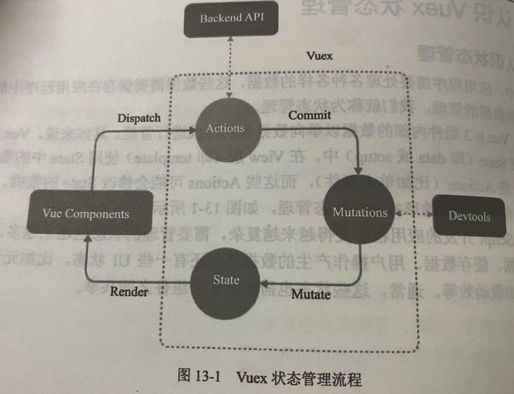

# 1-认识状态管理

- Vue3中,组件内部的数据以**单向数据流**的形式进行管理

- 组件的数据定义在State(`data()`/`setup()`)中
- View层使用State中的数据
- View层会产生一些Actions(比如点击事件)
- 这些Actions可能会修改State中的数据

- 但是,当状态需要在多个组件之间共享时,这个思路就不适用了
- 这种场景下,如果使用`defineProp()`/`provide()`&`inject()`的方式在多个组件之间共享数据,则状态会变得非常难以控制和追踪

- 核心思路:
  - 将组件内部的State抽离出来,以一个全局单例的方式进行管理
  - 通过插件的形式将该单例挂载到Vue实例上,任何组件都能从该单例上获取状态或触发行为

- 在State中定义全局状态(数据)
- 在Vue Components中使用State定义的状态
- Vue Components通过Dispatch分发Actions
  - (也可以直接通过Commit提交到Mutations)
- Actions支持编写异步逻辑,将异步请求的数据提交到Mutations中
- Mutations以同步的方式修改State中的数据,且State中的数据只能通过Mutations进行修改