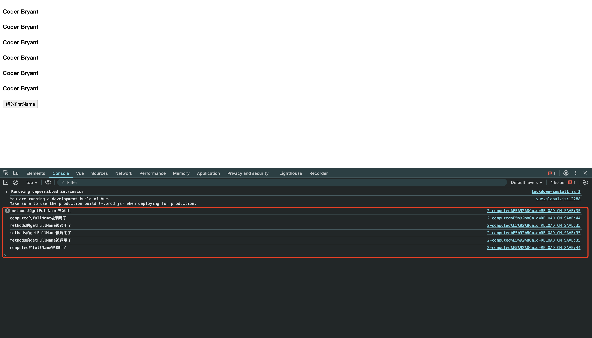

# 2-computed和methods的区别

```html
<template id="my-app">
    <!--调用methods中的函数-->
    <h4>{{getFullName()}}</h4>
    <h4>{{getFullName()}}</h4>
    <h4>{{getFullName()}}</h4>
    <!--使用computed中的计算属性-->
    <h4>{{fullName}}</h4>
    <h4>{{fullName}}</h4>
    <h4>{{fullName}}</h4>

    <button @click="changeFirstName()">修改firstName</button>
</template>

<script src="https://unpkg.com/vue@3/dist/vue.global.js"></script>
<script>
    const args = {
        template: '#my-app',
        data() {
            return {
                firstName: 'Kobe',
                lastName: 'Bryant',
            }
        },
        methods: {
            getFullName() {
                console.log('methods的getFullName被调用了')
                return this.firstName + ' ' + this.lastName
            },
            changeFirstName() {
                this.firstName = 'Coder'
            },
        },
        computed: {
            fullName() {
                console.log('computed的fullName被调用了')
                return this.firstName + ' ' + this.lastName
            },
        }
    }

    const app = Vue.createApp(args)
    app.mount('#app')
</script>
```

- 现象:
    - 页面加载时:
        - `methods的getFullName被调用了`打印3次
        - `computed的fullName被调用了`打印1次
    - 修改`firstName`时:
        - `methods的getFullName被调用了`打印3次
        - `computed的fullName被调用了`打印1次
- 结论:
    - **计算属性是有缓存的,当多次使用计算属性时,只会执行1次;仅当依赖的数据发生变化时,才会重新计算**
    - `computed`和`methods`的区别:
        - `methods`中的函数,每次调用都会执行
        - `computed`中的计算属性,只有在依赖的数据发生变化时,才会重新计算

