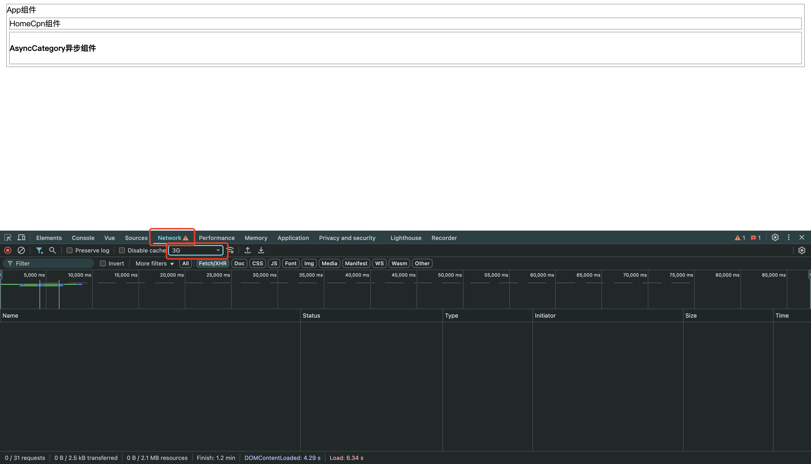

# 3-Suspense

**该组件现在是实验性特性**

在一个组件树中,若存在多个异步组件,则每个组件都要处理自己的加载/报错/完成状态.为统一处理这些异步组件,Vue3提供了一个内置组件`<Suspense>`,用于在组件树中协调对异步依赖的处理

`<Suspense>`可以:

- 让我们在组件树的上层等待下层多个嵌套异步依赖项解析完成
- 在等待时渲染一个加载状态(目的是为了防止看到多个Loading)
- 在不同时间点显示内容

如果在异步组件的父组件链中存在一个`<Suspense>`组件,则该异步组件将被视为该`<Suspense>`组件的异步依赖项.此时,异步组件的加载状态由`<Suspense>`组件控制,异步组件自身的加载/错误/延迟/超时选项都将被忽略

(若异步组件想脱离`<Suspense>`组件的控制,在选项中使用`suspense: false`即可)

`<Suspense>`组件包含2个插槽:

- `default`: 异步组件加载完成后渲染的内容
- `fallback`: 异步组件无法显示时渲染的内容

- 示例:

- `LoadingCpn.vue`:

```vue
<template>
    <div class="loading-cpn">
        Loading
    </div>
</template>

<script>
export default {
    name: "LoadingCpn",
}
</script>

<style scoped>

</style>
```

- `App.vue`:

```vue
<template>
    <div class="app">
        App组件
        <HomeCpn></HomeCpn>
        <suspense>
            <template #default>
                <AsyncCategory></AsyncCategory>
            </template>

            <template #fallback>
                <LoadingCpn></LoadingCpn>
            </template>
        </suspense>
    </div>
</template>

<script>
import {defineAsyncComponent} from "vue"
import HomeCpn from "@/components/HomeCpn.vue"
import LoadingCpn from "@/components/LoadingCpn.vue";

const AsyncCategory = defineAsyncComponent(() => import('@/components/AsyncCategory.vue'))

export default {
    name: 'App',
    components: {
        LoadingCpn,
        HomeCpn,
        AsyncCategory
    }
}
</script>

<style scoped>
.app{
    border: 1px solid #999;
    margin: 5px;
}
</style>
```

- 测试:

- step1. 调整浏览器模拟3G网络



- step2. 刷新页面,查看效果
  - 可以看到,`<Suspense>`组件先渲染了`<LoadingCpn>`组件,然后再渲染`<AsyncCategory>`组件