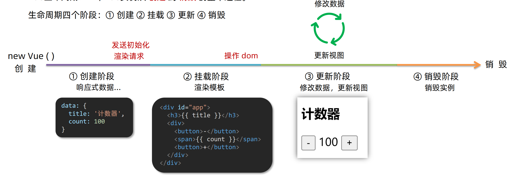

# 01-生命周期及其钩子函数

- 这里说的生命周期,是指Vue实例的生命周期,组件的生命周期和Vue实例的生命周期是一样的
- 什么时候可以发送请求?(越早越好)
- 什么时候可以开始操作DOM? (至少需要等到DOM渲染完成)
- 生命周期的4个阶段:
  - 创建
  - 挂载
  - 更新
  - 销毁



- 创建阶段:
  - 数据已经准备好了,方法也已经可以调用了,但尚未渲染DOM
  - 这个阶段完成时,就可以发送AJAX请求了
- 挂载阶段:
  - 所谓挂载,其实就是渲染模板,把数据渲染到DOM上
  - 在这个阶段,图中的`{{title}}`和`{{count}}`就被替换为了数据的字面量
  - **挂载完成**就可以操作DOM了
- 更新阶段:
  - 随着修改数据而更新DOM,是一个循环的过程
- 销毁阶段:
  - 这个阶段用于清理缓存/定时器等,用的比较少


- [生命周期钩子](https://cn.vuejs.org/guide/essentials/lifecycle)
- [生命周期选项](https://cn.vuejs.org/api/options-lifecycle.html#options-lifecycle)

- 钩子函数: 在Vue的生命周期过程中,会自动运行一些函数,这些函数被称为生命周期钩子,用于在特定阶段运行开发者的代码
- 钩子函数的执行顺序:
  - beforeCreate
  - created
    - 常用,此时可以发送AJAX请求
  - beforeMount
  - mounted
    - 常用,此时可以操作DOM
  - beforeUpdate
    - 此时DOM尚未被更新,但数据已经被更新
  - updated
  - beforeUnmount
  - unmounted

```vue
<template>
    <div class="app">
        <h3>{{ title }}</h3>
        <div>
            <button @click="count--">-</button>
            <span>{{ count }}</span>
            <button @click="count++">+</button>
        </div>
    </div>
</template>

<script>
export default {
    data() {
        return {
            count: 100,
            title: '计数器'
        }
    },
    methods: {
        myMethod() {
            console.log('myMethod 方法被调用')
        }
    },
    // 组件创建之前
    beforeCreate() {
        // 此时数据还没有被初始化 也不能调用methods中的方法
        console.log('beforeCreate 组件创建之前: ', this.count)
    },
    // 组件创建之后
    created() {
        // 此时数据已经被初始化 方法也可以被调用
        console.log('created 组件创建之后: ', this.count)
        this.myMethod()
    },
    // 组件挂载之前
    beforeMount() {
        // 此时DOM尚未被渲染
        console.log('beforeMount 组件挂载之前: ', document.querySelector('h3'))
    },
    // 组件挂载之后
    mounted() {
        // 此时DOM已经被渲染
        console.log('mounted 组件挂载之后: ', document.querySelector('h3'))
    },
    beforeUpdate() {
      // 此时DOM尚未被更新 但数据已经被更新
      console.log('beforeUpdate 组件更新之前: ', this.count, document.querySelector('span').innerHTML)
    },
    // 组件更新之后
    updated() {
        // 此时DOM已经被更新
        console.log('updated 组件更新之后: ', document.querySelector('span').innerHTML)
    },
    // 组件卸载之前
    beforeUnmount() {
        // 此时DOM尚未被卸载
        console.log('beforeUnmount 组件卸载之前: ', document.querySelector('h3'))
    },
    // 组件卸载之后
    unmounted() {
        // 此时DOM已经被卸载
        console.log('unmounted 组件卸载之后: ', document.querySelector('h3'))
    },
}
</script>
```

浏览器控制台结果:

```
beforeCreate 组件创建之前:  undefined
created 组件创建之后:  100
myMethod 方法被调用
beforeMount 组件挂载之前:  null
mounted 组件挂载之后:  <h3>计数器</h3>
beforeUpdate 组件更新之前:  101 100
updated 组件更新之后:  101
```