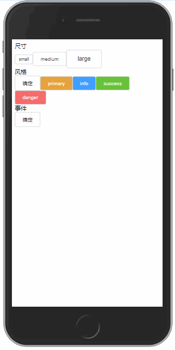

# 05-作业-封装按钮、弹层、提示框组件

## 1. 需求



## 2. 实现

### 2.1 按钮

- 接收3个props:
  - content: 按钮内容
  - type: 文字/按钮颜色
  - size: 按钮尺寸

```vue
<template>
    <button class="button-cpn" :class="[type, size]">{{content}}</button>
</template>

<script>
export default {
    name: 'ButtonCpn',
    props: {
        content: {
            type: String,
            required: true,
            validator(value) {
                return value.length > 0
            }
        },
        type: {
            type: String,
            default: 'default',
            validator(value) {
                const validTypes = ['default', 'primary', 'success', 'info', 'danger']
                return validTypes.includes(value)
            }
        },
        size: {
            type: String,
            default: 'medium',
            validator(value) {
                const validSizes = ['small', 'medium', 'large']
                return validSizes.includes(value)
            }
        }
    }
}
</script>

<style scoped>
.default {
    color: #333333;
    background-color: #FFFFFF;
}

.primary {
    color: #FFFFFF;
    background-color: #E6A23C;
}

.success {
    color: #FFFFFF;
    background-color: #67C23A;
}

.info {
    color: #FFFFFF;
    background-color: #409EFF;
}

.danger {
    color: #FFFFFF;
    background-color: #F56C6C;
}

.small {
    padding: 5px;
    font-size: 12px;
}

.medium {
    padding: 10px 20px;
    font-size: 14px;
}

.large {
    padding: 15px 30px;
    font-size: 16px;
}
</style>
```

### 2.2 模态框

```vue
<template>
    <div class="modal-cpn" v-if="show">
        <div class="modal-content">
            <p>模态框标题</p>
            <div class="btn-wrap">
                <ButtonCpn
                    content="确定"
                    type="primary"
                    size="medium"
                    @click="hidden"
                >
                </ButtonCpn>

                <ButtonCpn
                    content="取消"
                    type="success"
                    size="medium"
                    @click="hidden"
                ></ButtonCpn>
            </div>
        </div>
    </div>
</template>

<script>
import ButtonCpn from "@/components/ButtonCpn.vue"

export default {
    name: "ModalCpn",
    components: {
        ButtonCpn
    },
    props: {
        show: {
            type: Boolean,
            default: false,
        }
    },
    emits: {
        'update:show': null,
    },
    methods: {
        hidden() {
            this.$emit('update:show', false)
        }
    },
}
</script>

<style scoped>
/* 遮罩层样式 */
.modal-cpn {
    position: fixed;
    top: 0;
    left: 0;
    z-index: 999;
    width: 100%;
    height: 100%;
    background-color: rgba(0, 0, 0, 0.5);
    /* 模态框居中显示 */
    display: flex;
    justify-content: center;
    align-items: center;
}

.modal-content {
    background-color: #fefefe;
    /* %: 上下外边距为父元素高度的百分比 */
    margin: 15% auto;
    padding: 20px;
    border: 1px solid #888888;
    width: 80%;
    border-radius: 8px;
}

.btn-wrap {
    padding: 20px;
    display: flex;
    justify-content: space-around;
    align-items: center;
}
</style>
```

### 2.3 父组件

```vue
<template>
    <div class="app">
        <h4>尺寸</h4>
        <Component
            :is="buttonCpnName"
            v-for="(sizeOption, index) in sizeOptions"
            :key="index"
            v-model:content="sizeOptions[index].content"
            v-model:type="sizeOptions[index].type"
            v-model:size="sizeOptions[index].size"
        >
        </Component>

        <Component
            :is="buttonCpnName"
            v-model:content="modalBtnOption.content"
            v-model:type="modalBtnOption.type"
            v-model:size="modalBtnOption.size"
            @click="toggleModal"
        >
        </Component>

        <ModalCpn
            v-model:show="showModal"
            @update:show="hiddenModal"
        >
        </ModalCpn>
    </div>
</template>

<script>
import ButtonCpn from "@/components/ButtonCpn.vue"
import ModalCpn from "@/components/ModalCpn.vue";

export default {
    name: 'App',
    data() {
        return {
            sizeOptions: [
                {
                    content: '小按钮',
                    type: 'primary',
                    size: 'small',
                },
                {
                    content: '中按钮',
                    type: 'success',
                    size: 'medium',
                },
                {
                    content: '大按钮',
                    type: 'primary',
                    size: 'large',
                },
            ],
            buttonCpnName: 'ButtonCpn',
            modalBtnOption: {
                content: '弹层按钮',
                type: 'primary',
                size: 'medium',
            },
            showModal: false,
        }
    },
    components: {
        ModalCpn,
        ButtonCpn,
    },
    methods: {
        toggleModal() {
            console.log(123)
            this.showModal = !this.showModal
        },
        hiddenModal(val) {
            this.showModal = val
        }
    }
}
</script>
```